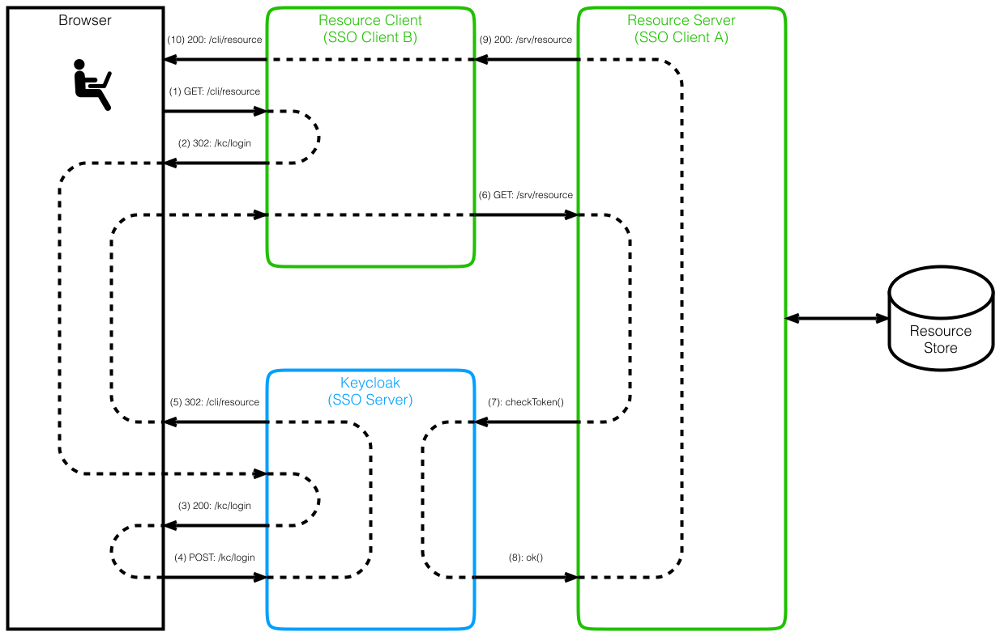
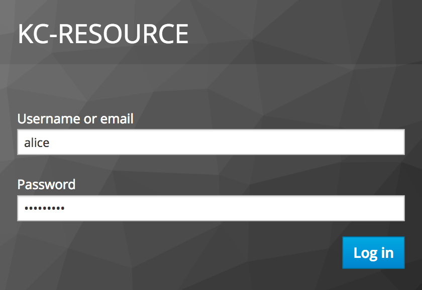
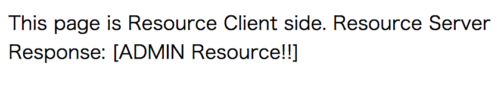

## 概要
KeycloakによるSSO基盤構築検証のメモ。SSOサーバー(Keycloak)のセットアップと、SSOクライアント(リソースサーバー、リソースクライアント)の開発を順に見ていきます。

この手順で使用したコードは、以下に公開しているので、こちらも参考にしてください。<br>
[https://github.com/yo1000/kc-resource](https://github.com/yo1000/kc-resource)


## 要件
### 環境
今回の作業環境は以下のとおりです。

- Java 1.8.0_131
- Spring Boot 1.5.9.RELEASE
- Keycloak 3.4.1.Final

```console
$ sw_vers
ProductName:	Mac OS X
ProductVersion:	10.12.5
BuildVersion:	16F2073

$ java -version
java version "1.8.0_131"
Java(TM) SE Runtime Environment (build 1.8.0_131-b11)
Java HotSpot(TM) 64-Bit Server VM (build 25.131-b11, mixed mode)
```


### 認証認可フロー
構築しようとしている認証認可フローの概要図は、以下のとおりです。



各アクターの役割は、以下のとおりです。

- User
  - Browserを操作して、リソースを表示するサイトを要求します
  - 認証を必要とした場合に、ログインします
- Keycloak
  - SSO基盤です
  - ユーザーを認証認可します
  - クライアント(認証認可情報を要求してきたアプリケーション)を認証認可します
- Resource Server
  - Resource Storeからリソースを取得して、クライアントへ提供します
    - _今回のサンプルでは、Resource Storeからのリソース取得については実装しません_
    - _今回のサンプルでは、ロールに応じた静的な値をリソースとして返却させます_
- Resource Client
  - Resource Serverからリソースを取得して、画面に結果を表示します


### 備考
以降、一連の流れを実施するにあたり、ディレクトリ移動が数回発生するため、便宜上、`${BASE_DIR}`をディレクトリの基点として使用します。

```console
$ BASE_DIR=`pwd`
```


## Keycloakのセットアップ(SSO Server)
### ダウンロード 展開
執筆時点での最新は、[3.4.1.Final](http://www.keycloak.org/archive/downloads-3.4.1.html)<br>
Download URL:
[https://downloads.jboss.org/keycloak/3.4.1.Final/keycloak-3.4.1.Final.tar.gz](https://downloads.jboss.org/keycloak/3.4.1.Final/keycloak-3.4.1.Final.tar.gz)

```console
$ cd ${BASE_DIR}
$ curl https://downloads.jboss.org/keycloak/3.4.1.Final/keycloak-3.4.1.Final.tar.gz \
  | tar -zxvf -
$ cd keycloak-3.4.1.Final
```


### Keycloakの初期設定 起動
管理ユーザーは、以下いずれかの方法で追加します。

- ホスト内の`add-user-keycloak.sh`による登録_(今回はこちらを使用)_
- 同一ホストからのアクセスによるAdmin Consoleでの登録

今回はすべてローカルホストに構築しているため、気にする必要はありませんが、セットアップ後、初めて作成する管理ユーザーは、**リモートホストから、直接追加することができない**ため、セットアップ時に一緒に作成しておく必要があります。

```console
$ # Add admin user for WildFly Management Console
$ bin/add-user.sh \
  -u wildfly \
  -p wildfly1234
Added user 'wildfly' to file '/workDir/keycloak-3.4.1.Final/standalone/configuration/mgmt-users.properties'
Added user 'wildfly' to file '/workDir/keycloak-3.4.1.Final/domain/configuration/mgmt-users.properties'

$ # Add admin user for Keycloak Admin Console
$ bin/add-user-keycloak.sh \
  -r master \
  -u keycloak \
  -p keycloak1234
Added 'admin' to '/workDir/keycloak-3.4.1.Final/standalone/configuration/keycloak-add-user.json', restart server to load user

$ # Run Keycloak
$ bin/standalone.sh \
  -b 0.0.0.0 &
..
18:38:14,161 INFO  [org.jboss.as] (Controller Boot Thread) WFLYSRV0025: Keycloak 3.4.1.Final (WildFly Core 3.0.8.Final) started in 61427ms - Started 545 of 881 services (604 services are lazy, passive or on-demand)
```


### Keycloakヘログイン
以降、`kcadm.sh`を使用する上で、ログイン状態が必要になるため、ログインします。`kcadm.sh`実行時に、以下のようなメッセージが出力された場合は、ログインセッションが期限切れとなっているため、改めてログインします。

> Session has expired. Login again with 'kcadm.sh config credentials'

```console
$ # Login to Keycloak
$ bin/kcadm.sh config credentials \
  --server http://127.0.0.1:8080/auth \
  --realm master \
  --user keycloak \
  --password keycloak1234
Logging into http://127.0.0.1:8080/auth as user admin of realm master
```


### Realmの作成
レルムは`領域・範囲・部門`といった単語に略されるもので、そのログインが、どのような種類のリソースにアクセスするためのものかを区別、管理するための単位です。より端的には、レルムが分離されていると、ログイン画面のURLが分離されます。

使用例としては、顧客が使用するシステムと、システム管理者が使用するシステムで、同じSSO基盤(Keycloak)を使用しながらも、ログインフォームや、ログイン後に使用されるロールや、グループの管理を、完全に分離しておきたいような場合に活用できます。

```console
$ # Create realm
$ bin/kcadm.sh create realms \
  -s realm=kc-resource \
  -s enabled=true
Created new realm with id 'kc-resource'

$ # Create realm roles
$ bin/kcadm.sh create roles \
  -r kc-resource \
  -s name=admin
Created new role with id 'admin'
$ bin/kcadm.sh create roles \
  -r kc-resource \
  -s name=user
Created new role with id 'user'
```


### ユーザーの登録
`kc-resource`レルムにユーザーを追加していきます。管理ユーザーとして`alice`を、一般ユーザーとして`bob`を、それぞれ作成します。

```console
$ # Create realm users
$ bin/kcadm.sh create users \
  -r kc-resource \
  -s username=alice \
  -s enabled=true
Created new user with id '26c64aeb-6d09-4d58-afac-fd7550d4ff7b'
$ bin/kcadm.sh create users \
  -r kc-resource \
  -s username=bob \
  -s enabled=true
Created new user with id '8ab8768a-a2b1-479d-be11-3d7dd1b3d3db'

$ # Update password
$ bin/kcadm.sh set-password \
  -r kc-resource \
  --username alice \
  -p alice1234
$ bin/kcadm.sh set-password \
  -r kc-resource \
  --username bob \
  -p bob1234

$ # Add realm roles to users
$ bin/kcadm.sh add-roles \
  -r kc-resource \
  --uusername alice \
  --rolename admin \
  --rolename user
$ bin/kcadm.sh add-roles \
  -r kc-resource \
  --uusername bob \
  --rolename user
```


### SSOクライアントの登録
SSO基盤を使用するアプリケーション(SSOサーバーに対する、クライアント)を登録します。リソースサーバーとして`kc-resource-server`を、リソースクライアントとして`kc-resource-client`をそれぞれ作成します。

リソースサーバー、リソースクライアントという、**リソースに対して、サーバー・クライアントの関係にある2つのアプリケーション**を作成しますが、これらアプリケーションは、**いずれもSSOサーバーから見れば、等しくSSOクライアント**となります。

```console
$ # Add realm client for Resource server
$ RES_SRV_ID=`bin/kcadm.sh create clients -r kc-resource -s clientId=kc-resource-server -s bearerOnly=true -i`; \
  echo $RES_SRV_ID
58f8a1ad-a409-4f22-9bb8-de10f9ca5365

$ # Add realm client for Resource client
$ RES_CLI_ID=`bin/kcadm.sh create clients -r kc-resource -s clientId=kc-resource-client -s 'redirectUris=["http://localhost:28080/*"]' -i`; \
  echo $RES_CLI_ID
373d1ce7-19c2-4a40-b1a3-deb3e4a02c83
```


## リソースサーバーの実装(SSO Client - A)
### プロジェクトの作成
Spring Initializrで、リソースサーバー用のプロジェクトを作成します。

```console
$ cd ${BASE_DIR}
$ curl https://start.spring.io/starter.tgz \
  -d dependencies="web,security,keycloak" \
  -d language="kotlin" \
  -d javaVersion="1.8" \
  -d packaging="jar" \
  -d bootVersion="1.5.9.RELEASE" \
  -d type="maven-project" \
  -d groupId="com.yo1000" \
  -d artifactId="kc-resource-server" \
  -d version="1.0.0-SNAPSHOT" \
  -d name="kc-resource-server" \
  -d description="Keycloak Client Demo - Resource Server" \
  -d packageName="com.yo1000.keycloak.resource.server" \
  -d baseDir="kc-resource-server" \
  -d applicationName="KcResourceServerApplication" \
  | tar -xzvf -

$ ls kc-resource-server
mvnw		mvnw.cmd	pom.xml		src

$ cd kc-resource-server
```


### 設定ファイルの配置
リソースサーバー用の、構成ファイルをセットアップします。

```console
$ sed -i '' \
  's/<keycloak.version>3.4.0.Final<\/keycloak.version>/<keycloak.version>3.4.1.Final<\/keycloak.version>/g' \
  pom.xml

$ mv \
  src/main/resources/application.properties \
  src/main/resources/application.yml

$ echo 'server.port: 18080

keycloak:
  realm: kc-resource
  resource: kc-resource-server
  bearer-only: true
  auth-server-url: http://127.0.0.1:8080/auth
  ssl-required: external
' > src/main/resources/application.yml
```


### セキュリティ構成の実装
コード例の後に、要点をまとめます。

```console
$ echo 'package com.yo1000.keycloak.resource.server

import org.keycloak.adapters.springsecurity.config.KeycloakWebSecurityConfigurerAdapter
import org.springframework.context.annotation.Bean
import org.springframework.context.annotation.Configuration
import org.springframework.security.config.annotation.web.configuration.EnableWebSecurity
import org.springframework.security.web.authentication.session.NullAuthenticatedSessionStrategy
import org.springframework.security.web.authentication.session.SessionAuthenticationStrategy
import org.springframework.security.core.authority.mapping.SimpleAuthorityMapper
import org.springframework.security.core.authority.mapping.GrantedAuthoritiesMapper
import org.keycloak.adapters.springsecurity.authentication.KeycloakAuthenticationProvider
import org.springframework.security.config.annotation.authentication.builders.AuthenticationManagerBuilder
import org.springframework.security.config.annotation.web.builders.HttpSecurity
import org.springframework.boot.web.servlet.FilterRegistrationBean
import org.keycloak.adapters.springsecurity.filter.KeycloakPreAuthActionsFilter
import org.keycloak.adapters.springsecurity.filter.KeycloakAuthenticationProcessingFilter
import org.keycloak.adapters.springboot.KeycloakSpringBootConfigResolver
import org.keycloak.adapters.KeycloakConfigResolver

@Configuration
@EnableWebSecurity
class KcSecurityConfigurer: KeycloakWebSecurityConfigurerAdapter() {
    @Bean
    fun grantedAuthoritiesMapper(): GrantedAuthoritiesMapper {
        val mapper = SimpleAuthorityMapper()
        mapper.setConvertToUpperCase(true)
        return mapper
    }

    @Bean
    fun keycloakConfigResolver(): KeycloakConfigResolver {
        return KeycloakSpringBootConfigResolver()
    }

    @Bean
    fun keycloakAuthenticationProcessingFilterRegistrationBean(
            filter: KeycloakAuthenticationProcessingFilter): FilterRegistrationBean {
        val registrationBean = FilterRegistrationBean(filter)
        registrationBean.isEnabled = false
        return registrationBean
    }

    @Bean
    fun keycloakPreAuthActionsFilterRegistrationBean(
            filter: KeycloakPreAuthActionsFilter): FilterRegistrationBean {
        val registrationBean = FilterRegistrationBean(filter)
        registrationBean.isEnabled = false
        return registrationBean
    }

    override fun sessionAuthenticationStrategy(): SessionAuthenticationStrategy {
        return NullAuthenticatedSessionStrategy()
    }

    override fun keycloakAuthenticationProvider(): KeycloakAuthenticationProvider {
        val provider = super.keycloakAuthenticationProvider()
        provider.setGrantedAuthoritiesMapper(grantedAuthoritiesMapper())
        return provider
    }

    override fun configure(auth: AuthenticationManagerBuilder?) {
        auth!!.authenticationProvider(keycloakAuthenticationProvider())
    }

    override fun configure(http: HttpSecurity) {
        super.configure(http)
        http
                .authorizeRequests()
                .antMatchers("/kc/resource/server/admin").hasRole("ADMIN")
                .antMatchers("/kc/resource/server/user").hasRole("USER")
                .anyRequest().permitAll()
    }
}
' > src/main/kotlin/com/yo1000/keycloak/resource/server/KcSecurityConfigurer.kt
```


#### configure(http: HttpSecurity)
認証で保護したいURLのパターンと、許可するロールの組み合わせを正しく設定します。この設定に誤りがあると、SSO基盤へのリダイレクトに失敗します。


#### grantedAuthoritiesMapper(): GrantedAuthoritiesMapper
認証基盤でロール名を小文字や、大文字小文字混在で設定しても、`mapper.setConvertToUpperCase(true)`を設定することで、プログラムから扱う場合に、すべて大文字で統一することができます。


### コントローラーの実装
リソースを返却するエンドポイントとなる、API用コントローラーを実装します。

```console
$ echo 'package com.yo1000.keycloak.resource.server

import org.springframework.web.bind.annotation.GetMapping
import org.springframework.web.bind.annotation.RequestMapping
import org.springframework.web.bind.annotation.RestController

@RestController
@RequestMapping("/kc/resource/server")
class KcResourceServerController {
    @GetMapping("/admin")
    fun getAdminResource(): String {
        return "ADMIN Resource!!"
    }

    @GetMapping("/user")
    fun getUserResource(): String {
        return "USER Resource."
    }
}
' > src/main/kotlin/com/yo1000/keycloak/resource/server/KcResourceServerController.kt 
```


### ビルド 起動
リソースサーバー用アプリケーションを起動します。

```console
$ ./mvnw clean spring-boot:run &
```


## リソースクライアントの実装(SSO Client - B)
### プロジェクトの作成
Spring Initializrで、リソースクライアント用のプロジェクトを作成します。

```console
$ cd ${BASE_DIR}
$ curl https://start.spring.io/starter.tgz \
  -d dependencies="web,security,keycloak" \
  -d language="kotlin" \
  -d javaVersion="1.8" \
  -d packaging="jar" \
  -d bootVersion="1.5.9.RELEASE" \
  -d type="maven-project" \
  -d groupId="com.yo1000" \
  -d artifactId="kc-resource-client" \
  -d version="1.0.0-SNAPSHOT" \
  -d name="kc-resource-client" \
  -d description="Keycloak Client Demo - Resource Client" \
  -d packageName="com.yo1000.keycloak.resource.client" \
  -d baseDir="kc-resource-client" \
  -d applicationName="KcResourceClientApplication" \
  | tar -xzvf -

$ ls kc-resource-client
mvnw		mvnw.cmd	pom.xml		src

$ cd kc-resource-client
```


### 設定ファイルの配置
リソースクライアント用の、構成ファイルをセットアップします。

こちらでは、リソースサーバーでは設定しなかった`keycloak.json`が必要になります。[Set up Clients](#set-up-clients)で`$RES_CLI_ID`変数に取っておいた、クライアントIDを使用して、`keycloak.json`を出力します。

```console
$ # Update Keycloak dependency version
$ sed -i '' \
  's/<keycloak.version>3.4.0.Final<\/keycloak.version>/<keycloak.version>3.4.1.Final<\/keycloak.version>/g' \
  pom.xml

$ # Configure application.yml
$ mv \
  src/main/resources/application.properties \
  src/main/resources/application.yml
$ echo 'server.port: 28080

keycloak:
  realm: kc-resource
  resource: kc-resource-client
  auth-server-url: http://127.0.0.1:8080/auth
' > src/main/resources/application.yml

$ # Install credentials
$ ${BASE_DIR}/keycloak-3.4.1.Final/bin/kcadm.sh \
  get clients/${RES_CLI_ID}/installation/providers/keycloak-oidc-keycloak-json \
  -r kc-resource \
  > src/main/resources/keycloak.json 
```


### セキュリティ構成の実装
コード例の後に、要点をまとめます。

Resource Server用の実装で触れたものと概ね同様ですが、`adapterDeploymentContext()`の説明を追加しています。

```console
$ echo 'package com.yo1000.keycloak.resource.client

import org.keycloak.adapters.AdapterDeploymentContext
import org.keycloak.adapters.springsecurity.AdapterDeploymentContextFactoryBean
import org.keycloak.adapters.springsecurity.KeycloakConfiguration
import org.keycloak.adapters.springsecurity.authentication.KeycloakAuthenticationProvider
import org.keycloak.adapters.springsecurity.client.KeycloakClientRequestFactory
import org.keycloak.adapters.springsecurity.client.KeycloakRestTemplate
import org.keycloak.adapters.springsecurity.config.KeycloakWebSecurityConfigurerAdapter
import org.keycloak.adapters.springsecurity.filter.KeycloakAuthenticationProcessingFilter
import org.keycloak.adapters.springsecurity.filter.KeycloakPreAuthActionsFilter
import org.springframework.beans.factory.config.ConfigurableBeanFactory
import org.springframework.boot.autoconfigure.SpringBootApplication
import org.springframework.boot.autoconfigure.condition.ConditionalOnClass
import org.springframework.boot.web.servlet.FilterRegistrationBean
import org.springframework.context.annotation.Bean
import org.springframework.context.annotation.Scope
import org.springframework.core.io.ClassPathResource
import org.springframework.security.config.annotation.authentication.builders.AuthenticationManagerBuilder
import org.springframework.security.config.annotation.web.builders.HttpSecurity
import org.springframework.security.core.authority.mapping.GrantedAuthoritiesMapper
import org.springframework.security.core.authority.mapping.SimpleAuthorityMapper
import org.springframework.security.core.session.SessionRegistryImpl
import org.springframework.security.web.authentication.session.RegisterSessionAuthenticationStrategy
import org.springframework.security.web.authentication.session.SessionAuthenticationStrategy

@KeycloakConfiguration
class SecurityConfiguration : KeycloakWebSecurityConfigurerAdapter() {
    @Bean
    @Scope(ConfigurableBeanFactory.SCOPE_PROTOTYPE)
    fun keycloakRestTemplate(keycloakClientRequestFactory: KeycloakClientRequestFactory): KeycloakRestTemplate {
        return KeycloakRestTemplate(keycloakClientRequestFactory)
    }

    @Bean
    override fun sessionAuthenticationStrategy(): SessionAuthenticationStrategy {
        return RegisterSessionAuthenticationStrategy(SessionRegistryImpl())
    }

    @Bean
    override fun adapterDeploymentContext(): AdapterDeploymentContext {
        val factoryBean = AdapterDeploymentContextFactoryBean(ClassPathResource("keycloak.json"))
        factoryBean.afterPropertiesSet()
        return factoryBean.`object`
    }

    @Bean
    fun keycloakAuthenticationProcessingFilterRegistrationBean(
            filter: KeycloakAuthenticationProcessingFilter): FilterRegistrationBean {
        val registrationBean = FilterRegistrationBean(filter)
        registrationBean.isEnabled = false
        return registrationBean
    }

    @Bean
    @ConditionalOnClass(SpringBootApplication::class)
    fun keycloakPreAuthActionsFilterRegistrationBean(
            filter: KeycloakPreAuthActionsFilter): FilterRegistrationBean {
        val registrationBean = FilterRegistrationBean(filter)
        registrationBean.isEnabled = false
        return registrationBean
    }

    @Bean
    fun grantedAuthoritiesMapper(): GrantedAuthoritiesMapper {
        val mapper = SimpleAuthorityMapper()
        mapper.setConvertToUpperCase(true)
        return mapper
    }

    override fun keycloakAuthenticationProvider(): KeycloakAuthenticationProvider {
        val provider = super.keycloakAuthenticationProvider()
        provider.setGrantedAuthoritiesMapper(grantedAuthoritiesMapper())
        return provider
    }

    override fun configure(auth: AuthenticationManagerBuilder?) {
        auth!!.authenticationProvider(keycloakAuthenticationProvider())
    }

    override fun configure(http: HttpSecurity) {
        super.configure(http)
        http
                .authorizeRequests()
                .antMatchers("/kc/resource/client/user").hasRole("USER")
                .antMatchers("/kc/resource/client/admin").hasRole("ADMIN")
                .anyRequest().permitAll()
    }
}
' > src/main/kotlin/com/yo1000/keycloak/resource/client/SecurityConfiguration.kt
```


#### configure(http: HttpSecurity)
認証で保護したいURLのパターンと、許可するロールの組み合わせを正しく設定します。この設定に誤りがあると、SSO基盤へのリダイレクトに失敗します。


#### grantedAuthoritiesMapper(): GrantedAuthoritiesMapper
認証基盤でロール名を小文字や、大文字小文字混在で設定しても、`mapper.setConvertToUpperCase(true)`を設定することで、プログラムから扱う場合に、すべて大文字で統一することができます。


#### adapterDeploymentContext(): AdapterDeploymentContext
アプリケーションが読み込む、`keycloak.json`の位置を変更します。デフォルトでは、`WEB-INF/keycloak.json`となっています。Spring Bootで、実行可能JARを作成する場合、`WEB-INF`にファイルを配置するのは一般的ではないため、`resources`直下に配置した、`keycloak.json`を読み込ませるようにします。


### KeycloakRestTemplateを使用するコントローラーの実装
リソースサーバーにリソースを要求して、結果を画面に表示するエンドポイントとなる、コントローラーを実装します。

```console
$ echo 'package com.yo1000.keycloak.resource.client

import org.keycloak.adapters.springsecurity.client.KeycloakRestTemplate
import org.springframework.stereotype.Controller
import org.springframework.web.bind.annotation.GetMapping
import org.springframework.web.bind.annotation.RequestMapping
import org.springframework.web.bind.annotation.ResponseBody

@Controller
@RequestMapping("/kc/resource/client")
class KcResourceClientController(
        val template: KeycloakRestTemplate
) {
    companion object {
        const val ENDPOINT = "http://localhost:18080/kc/resource/server/{role}"
    }

    @GetMapping("/admin")
    @ResponseBody
    fun getAdmin(): String {
        val resp = template.getForObject(ENDPOINT, String::class.java, mapOf("role" to "admin"))
        return """
            This page is Resource Client side.
            Resource Server Response: [$resp]
            """.trimIndent()
    }

    @GetMapping("/user")
    @ResponseBody
    fun getUser(): String {
        val resp = template.getForObject(ENDPOINT, String::class.java, mapOf("role" to "user"))
        return """
            This page is Resource Client side.
            Resource Server Response: [$resp]
            """.trimIndent()
    }
}
' > src/main/kotlin/com/yo1000/keycloak/resource/client/KcResourceClientController.kt
```


### ビルド 起動
リソースクライアント用アプリケーションを起動します。

```console
$ ./mvnw clean spring-boot:run &
```


## デモ
参考までに、実際に動かした結果を、以下キャプチャに残しておきます。

以下URLにアクセスしてみます。<br>
[http://localhost:28080/kc/resource/client/admin](http://localhost:28080/kc/resource/client/admin)

Keycloakへリダイレクトされ、ログインを要求されます。<br>


ログインすると、ロールに応じたメッセージが表示されます。<br>



## 参考
### ドキュメント
- [http://www.keycloak.org/](http://www.keycloak.org/)
- [http://blog.keycloak.org/2017/01/administer-keycloak-server-from-shell.html](http://blog.keycloak.org/2017/01/administer-keycloak-server-from-shell.html)
- [http://keycloak-documentation.openstandia.jp/master/ja_JP/securing_apps/index.html](http://keycloak-documentation.openstandia.jp/master/ja_JP/securing_apps/index.html)


### コード例
- [https://github.com/foo4u/keycloak-spring-demo](https://github.com/foo4u/keycloak-spring-demo)
- [https://sandor-nemeth.github.io/java/spring/2017/06/15/spring-boot-with-keycloak.html](https://sandor-nemeth.github.io/java/spring/2017/06/15/spring-boot-with-keycloak.html)
