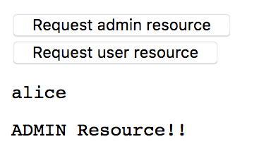

## 概要
Keycloakと、リソースサーバー、リソースクライアント間のSSO検証メモ。(Javascriptクライアント版)

すでに検証部分の大半は[過去のポスト](http://blog.yo1000.com/keycloak/keycloak-collabo-ressrv-rescli.html)で完了しているため、ここでは主にJavascript版での差分と、Javascriptクライアントからの利用方法を中心に書いていきます。

この手順で使用したコードは、以下に公開しているので、こちらも参考にしてください。<br>
[https://github.com/yo1000/kc-resource/tree/e09c1dd987/kc-resource-client-js](https://github.com/yo1000/kc-resource/tree/e09c1dd9876d2f3a9480cbf03e2ec826eb3f99de/kc-resource-client-js)


## 要件
### 環境
今回の作業環境は以下のとおりです。

- Java 1.8.0_131
- Spring Boot 1.5.9.RELEASE
- Keycloak 3.4.1.Final
- NodeJS v8.4.0
- NPM 5.6.0

```console
$ sw_vers
ProductName:	Mac OS X
ProductVersion:	10.12.5
BuildVersion:	16F2073

$ java -version
java version "1.8.0_131"
Java(TM) SE Runtime Environment (build 1.8.0_131-b11)
Java HotSpot(TM) 64-Bit Server VM (build 25.131-b11, mixed mode)

$ node -v
v8.4.0

$ npm -v
5.6.0
```


### 認証認可フロー
過去のポストで掲示しているものと同じですが、全体を把握するのに役立つため再掲します。認証認可フローの概要図は、以下のとおりです。


各アクターの役割は、以下のとおりです。

- User
  - Browserを操作して、リソースを表示するサイトを要求します
  - 認証を必要とした場合に、ログインします
- Keycloak
  - SSO基盤です
  - ユーザーを認証認可します
  - クライアント(認証認可情報を要求してきたアプリケーション)を認証認可します
- Resource Server
  - Resource Storeからリソースを取得して、クライアントへ提供します
    - _今回のサンプルでは、Resource Storeからのリソース取得については実装しません_
    - _今回のサンプルでは、ロールに応じた静的な値をリソースとして返却させます_
- Resource Client
  - Resource Serverからリソースを取得して、画面に結果を表示します


### 備考
以降、一連の流れを実施するにあたり、複数のディレクトリで作業するため、便宜上、`${BASE_DIR}`をディレクトリの基点として使用します。また、ディレクトリ全体の構成は以下のようになります。

```console
$ BASE_DIR=`pwd`
$ tree -d -L 2
.
├── kc-resource
│   ├── kc-resource-client-js
│   └── kc-resource-server
└── keycloak-3.4.1.Final
    ├── bin
    ├── docs
    ├── domain
    ├── modules
    ├── standalone
    ├── themes
    └── welcome-content
```


## Keycloakのセットアップ(SSO Server)
[過去のポスト](http://blog.yo1000.com/keycloak/keycloak-collabo-ressrv-rescli.html#keycloak-%E3%81%AE%E3%82%BB%E3%83%83%E3%83%88%E3%82%A2%E3%83%83%E3%83%97-sso-server)で構築したものをそのまま使用します。

構築済みのKeycloakがない場合は、このポストを参考に準備してください。


### Keycloakヘログイン
以降、`kcadm.sh`を使用する上で、ログイン状態が必要になるため、ログインします。`kcadm.sh`実行時に、以下のようなメッセージが出力された場合は、ログインセッションが期限切れとなっているため、改めてログインします。

> Session has expired. Login again with ‘kcadm.sh config credentials’

```console
$ # Login to Keycloak
$ ${BASE_DIR}/keycloak-3.4.1.Final/bin/kcadm.sh config credentials \
  --server http://127.0.0.1:8080/auth \
  --realm master \
  --user keycloak \
  --password keycloak1234
Logging into http://127.0.0.1:8080/auth as user admin of realm master
```


### SSOクライアントの登録
SSO基盤を使用するアプリケーション(SSOサーバーに対する、クライアント)を登録します。リソースサーバーとして`kc-resource-server`は既に作成されているものとします。ここではリソースクライアントとして、新たに`kc-resource-client-js`を作成します。

```console
$ # Add realm client for Resource client (for Javascript)
$ RES_CLI_ID=`\
  ${BASE_DIR}/keycloak-3.4.1.Final/bin/kcadm.sh create clients \
  -r kc-resource \
  -s clientId=kc-resource-client-js \
  -s publicClient=true \
  -s 'redirectUris=["http://127.0.0.1:28081/*"]' \
  -s 'webOrigins=["http://127.0.0.1:28081"]' \
  -i\
  `; echo $RES_CLI_ID
f970945c-67dc-4c09-8126-423158ff1248
```


## リソースサーバーの実装(SSO Client - A)
[過去のポスト](http://blog.yo1000.com/keycloak/keycloak-collabo-ressrv-rescli.html)で構築したものに、必要な変更を加えていきます。

構築済みのリソースサーバーがない場合は、このポストを参考にするか、ポストの冒頭で挙げたGitHubリポジトリから、プロジェクトをクローンして準備してください。


### セキュリティ構成の実装
コード例の後に、要点をまとめます。

```kotlin{numberLines:true}
package com.yo1000.keycloak.resource.server

import org.keycloak.adapters.KeycloakConfigResolver
import org.keycloak.adapters.springboot.KeycloakSpringBootConfigResolver
import org.keycloak.adapters.springsecurity.authentication.KeycloakAuthenticationProvider
import org.keycloak.adapters.springsecurity.config.KeycloakWebSecurityConfigurerAdapter
import org.keycloak.adapters.springsecurity.filter.KeycloakAuthenticationProcessingFilter
import org.keycloak.adapters.springsecurity.filter.KeycloakPreAuthActionsFilter
import org.springframework.boot.web.servlet.FilterRegistrationBean
import org.springframework.context.annotation.Bean
import org.springframework.context.annotation.Configuration
import org.springframework.security.config.annotation.authentication.builders.AuthenticationManagerBuilder
import org.springframework.security.config.annotation.web.builders.HttpSecurity
import org.springframework.security.config.annotation.web.configuration.EnableWebSecurity
import org.springframework.security.core.authority.mapping.GrantedAuthoritiesMapper
import org.springframework.security.core.authority.mapping.SimpleAuthorityMapper
import org.springframework.security.web.authentication.session.NullAuthenticatedSessionStrategy
import org.springframework.security.web.authentication.session.SessionAuthenticationStrategy
import org.springframework.web.cors.CorsConfiguration
import org.springframework.web.cors.UrlBasedCorsConfigurationSource

@Configuration
@EnableWebSecurity
class KcSecurityConfiguration: KeycloakWebSecurityConfigurerAdapter() {
    @Bean
    fun grantedAuthoritiesMapper(): GrantedAuthoritiesMapper {
        val mapper = SimpleAuthorityMapper()
        mapper.setConvertToUpperCase(true)
        return mapper
    }

    @Bean
    fun keycloakConfigResolver(): KeycloakConfigResolver {
        return KeycloakSpringBootConfigResolver()
    }

    @Bean
    fun keycloakAuthenticationProcessingFilterRegistrationBean(
            filter: KeycloakAuthenticationProcessingFilter): FilterRegistrationBean {
        val registrationBean = FilterRegistrationBean(filter)
        registrationBean.isEnabled = false
        return registrationBean
    }

    @Bean
    fun keycloakPreAuthActionsFilterRegistrationBean(
            filter: KeycloakPreAuthActionsFilter): FilterRegistrationBean {
        val registrationBean = FilterRegistrationBean(filter)
        registrationBean.isEnabled = false
        return registrationBean
    }

    override fun sessionAuthenticationStrategy(): SessionAuthenticationStrategy {
        return NullAuthenticatedSessionStrategy()
    }

    override fun keycloakAuthenticationProvider(): KeycloakAuthenticationProvider {
        val provider = super.keycloakAuthenticationProvider()
        provider.setGrantedAuthoritiesMapper(grantedAuthoritiesMapper())
        return provider
    }

    override fun configure(auth: AuthenticationManagerBuilder?) {
        auth!!.authenticationProvider(keycloakAuthenticationProvider())
    }

    override fun configure(http: HttpSecurity) {
        super.configure(http)
        http
                .authorizeRequests()
                .antMatchers("/kc/resource/server/admin").hasRole("ADMIN")
                .antMatchers("/kc/resource/server/user").hasRole("USER")
                .anyRequest().permitAll()
                .and()
                .cors()
                .configurationSource(UrlBasedCorsConfigurationSource().apply {
                    registerCorsConfiguration("/**", CorsConfiguration().apply {
                        addAllowedHeader(CorsConfiguration.ALL)
                        addAllowedMethod("GET")
                        addAllowedOrigin("http://127.0.0.1:28081")
                        allowCredentials = true
                    })
                })
    }
}
```


#### configure(http: HttpSecurity)
認証で保護したいURLのパターンと、許可するロールの組み合わせを設定します。また、Javascriptクライアント向けに、CORS設定を追加しています。

CORS設定を適用するURLのパターン、およびクロスオリジンリクエストを許可するリクエストのパターンを設定します。ここでは主に以下の3点を設定します。

- Header: `CorsConfiguration.ALL`で、任意のヘッダーを持ったリクエストを許可
- Meathod: `"GET"`で、HTTP GETメソッドによるリクエストを許可
- Origin: 指定したドメインからのリクエストを許可

設定された**すべての条件を満たすリクエストのみ**が、クロスオリジンリクエストを許可されるようになります。


### ビルド 起動
リソースサーバー用アプリケーションを起動します。

```console
$ cd ${BASE_DIR}/kc-resource/kc-resource-server
$ ./mvnw clean spring-boot:run &
```


## リソースクライアントの実装(SSO Client - B)
### プロジェクトの作成
アプリケーションサーバーは必要ありませんが、HTTP Serverを起動しなければならないため、ここではnpmを使用します。以下のようにプロジェクト用ディレクトリの作成と、`package.json`を準備してください。

```console
$ mkdir ${BASE_DIR/kc-resource/}kc-resource-client-js
$ cd ${BASE_DIR/kc-resource/}kc-resource-client-js
```

```json{numberLines:true}
{
  "name": "kc-resource-client",
  "version": "1.0.0",
  "author": "",
  "license": "MIT",
  "description": "",
  "scripts": {
    "http": "http-server -o -p 28081"
  },
  "devDependencies": {
    "http-server": "^0.10.0"
  }
}
```

npmを使用しない場合でも、HTMLファイルをHTTPに公開可能であれば、ApacheやNginxへ公開するような形をとっても良いです。


### 設定ファイルの配置
リソースクライアント用の、構成ファイルをセットアップします。

Set up Clientsで`$RES_CLI_ID`変数に取っておいた、クライアントIDを使用して、`keycloak.json`を出力します。`keycloak.json`は、Keycloakの認証を受けるスクリプトが実行されるパスと、同じ場所に配置する必要があります。`index.html`内に認証スクリプトを実装する場合、以下のような構成になります。

```
$ cd ${BASE_DIR}/kc-resource/kc-resource-client-js
$ tree -I node_*
.
├── index.html
├── keycloak.json
└── package.json
```

`keycloak.json`は、`kcadm.sh`を使用して、以下のようにKeycloakサーバーから取得します。

```console
$ ${BASE_DIR}/keycloak-3.4.1.Final/bin/kcadm.sh \
  get clients/${RES_CLI_ID}/installation/providers/keycloak-oidc-keycloak-json \
  -r kc-resource \
  > ${BASE_DIR}/kc-resource/kc-resource-client-js/keycloak.json 
```


### 認証とリソース取得スクリプトの実装
ここまでできたら、JavascriptからSSOを利用する準備は整いました。スクリプトを実装して、実際にリソースサーバーからリソースを取得してみます。

コード例の後に、要点をまとめます。

```html{numberLines:true}
<!DOCTYPE html>
<html lang="en">
<head>
    <meta charset="UTF-8">
    <title>kc-resource-client</title>
</head>
<body>
<div>
    <button id="req-admin-btn">Request admin resource</button>
</div>
<div>
    <button id="req-user-btn">Request user resource</button>
</div>
<pre id="display-username"></pre>
<pre id="display-resource"></pre>
<script type="text/javascript" src="http://127.0.0.1:8080/auth/js/keycloak.js"></script>
<script type="text/javascript">
(function () {
    /**
     * @param keycloak
     * @param role
     */
    function getResource(keycloak, role) {
        if (!keycloak || !keycloak.token) {
            console.error('Require Authentication.');
            return;
        }

        if (!role) {
            console.error('Require Role in arguments.');
            return;
        }

        var url = 'http://localhost:18080/kc/resource/server/' + role;
        var xhr = new XMLHttpRequest();

        xhr.open('GET', url, true);
        xhr.setRequestHeader('Accept', 'application/json');
        xhr.setRequestHeader('Authorization', 'Bearer ' + keycloak.token);
        xhr.onreadystatechange = function () {
            var displayResource = document.getElementById('display-resource');

            if (xhr.readyState === 4) {
                if (xhr.status === 200) {
                    console.info('OK');
                    displayResource.innerText = xhr.responseText;
                } else if (xhr.status === 403) {
                    console.error('Forbidden');
                    displayResource.innerText = '[Forbidden]';
                } else {
                    console.error(xhr);
                }
            }
        };

        xhr.send();
    }

    /*
     * Will be run when page loading.
     */
    var keycloak = Keycloak();

    keycloak
        .init({
            "onLoad" : "login-required"
        })
        .success(function(authenticated) {
            console.info(authenticated ? 'Authenticated' : 'Not authenticated');
            console.debug(keycloak);

            var displayUsername = document.getElementById('display-username');
            displayUsername.innerText = keycloak.tokenParsed.preferred_username;
        }).error(function() {
        console.error('Failed to initialize');
    });

    var reqAdminBtn = document.getElementById('req-admin-btn');
    reqAdminBtn.addEventListener('click', function (e) {
        getResource(keycloak, 'admin');
    }, false);

    var reqUserBtn = document.getElementById('req-user-btn');
    reqUserBtn.addEventListener('click', function (e) {
        getResource(keycloak, 'user');
    }, false);
})();
</script>
</body>
</html>
```


#### keycloak.js
`<script type="text/javascript" src="http://127.0.0.1:8080/auth/js/keycloak.js"></script>`からも分かるように、Javascript用Keycloakアダプターライブラリは、Keycloakサーバー内にホストされています。アプリケーションが使用するKeycloakサーバー上のライブラリを参照する方法が推奨されており、この参照方法に従っておくと、Keycloakサーバーのバージョンアップ時などにスクリプトも合わせて最新化されるため、バージョンを追従できるようになります。


#### keycloak.token
`Keycloak`オブジェクトはSSOによる認証を受ける前と、受けた後でフィールドの状態が大きく変化します。認証前の状態では、`keycloak.token`を参照することはできません。認証後、`keycloak.token`が参照可能となり、リソースサーバーへの認証情報として使用可能になります。


#### keycloak.tokenParsed
`keycloak.token`同様に、認証後に参照可能になるフィールドです。このフィールドには認証を受けたユーザーや、そのロール、認証トークンの有効期限などが設定されています。


### ビルド・起動
リソースクライアント用ページを表示します。

```console
$ cd ${BASE_DIR}/kc-resource/kc-resource-client-js
$ npm install
$ npm run http
```


## デモ
参考までに、実際に動かした結果を、以下キャプチャに残しておきます。

以下npmコマンドを実行すると、公開されたページが表示されます。表示されなかった場合は、コマンド結果に従って、ブラウザで`http://127.0.0.1:28081`を表示してください。

```console
$ npm run http

> kc-resource-client@1.0.0 http ${BASE_DIR}/kc-resource/kc-resource-client-js
> http-server -o -p 28081

Starting up http-server, serving ./
Available on:
  http://127.0.0.1:28081
  http://10.0.0.7:28081
  http://10.211.55.2:28081
  http://10.37.129.2:28081
Hit CTRL-C to stop the server
```

初回表示では、Keycloakへリダイレクトされ、ログインを要求されます。<br>


ログインすると、画面にユーザー名が表示され、ボタンをクリックすると要求に応じたメッセージが表示されます。<br>



## 参考
- [http://www.keycloak.org/docs/3.1/securing_apps/topics/oidc/javascript-adapter.html](http://www.keycloak.org/docs/3.1/securing_apps/topics/oidc/javascript-adapter.html)
- [https://qiita.com/mamomamo/items/cdde95feffbb5e524fd4](https://qiita.com/mamomamo/items/cdde95feffbb5e524fd4)
