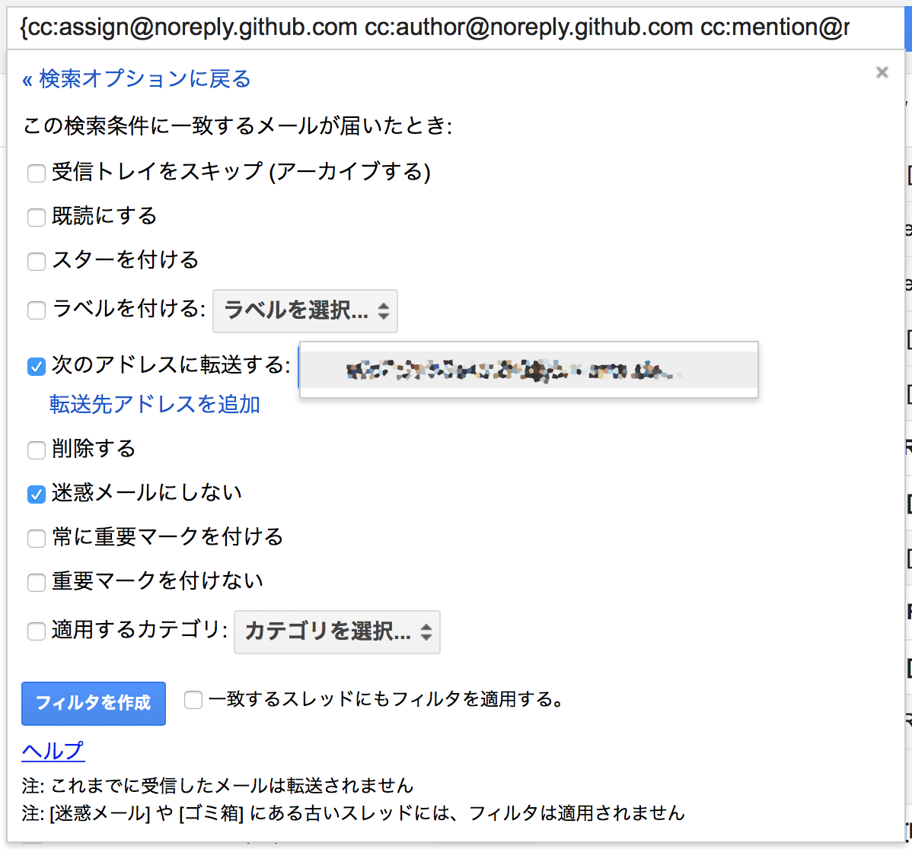

GitHubは、現在では無くてはならない開発インフラのひとつとなっていますが、いまいちその通知機能のバランスが悪く、重要な通知(レビューリクエストや、担当Issueの更新等)を見逃してしまいがちです。この通知機能のバランスの悪さの原因は、過剰に通知が送られてくることで、重要な通知が埋もれてしまいがちなところにあるように思えます。

ただ一方で、重要な通知については(総量としては過剰ではあるものの)漏らさず、しっかりと届けられてはいます。そのため、これら通知を適切に分類さえできれば、重要な通知を見逃すことがなくなるはずです。

というわけで、Gmailを有効活用します。

## 概要
以下のような連携を実現します。

## 要件
今回使用するのは以下の3つ。

- GitHub
- Gmail
- Slack(**Paid plan**: Email Integrationを使用します)

## 設定手順
### GitHub
通知の宛先を任意のGmailアドレスに設定します。GitHubでは通知用のメールアドレスを複数設定できるので、プライマリアドレスがGmailでない場合は、これを設定します。

### Slack
最終的にSlackへメール経由で通知をさせたいので、通知用メールアドレスを取得します。なお、メールの受信をトリガに通知できるものであれば、Slackでなくともよいです。(今回はSlackでの連携を例にします。)

1. Email Integration(https://slack.com/apps/A0F81496D-email)を開いて、[Add Configuration]をクリックします。
2. 通知先のチャネルを選択して、[Add Email Integration]をクリックします。
3. [Email Address]の項目に、ランダムなメールアドレスが発行、表示されるのでこれを控えておきます。

### Gmail
Gmailのフィルタを設定して、重要な通知のみを抽出します。GitHubではその通知内容に応じて、メールのCCに以下のようなアドレスを設定するため、これを利用します。

| メールアドレス                                            | 通知トリガー                                      |
| -------------------------------------------------------- | ------------------------------------------------- |
| `Assign <assign@noreply.github.com>`                     | アサインされたIssueやPRの更新。               |
| `Author <author@noreply.github.com>`                     | 作成したIssueやPRの更新。                     |
| `Comment <comment@noreply.github.com>`                   | コメントしたIssueやPRの更新。                 |
| `Mention <mention@noreply.github.com>`                   | メンションされたIssueやPRの更新。             |
| `Push <push@noreply.github.com>`                         | 通知対象になっているPRへのプッシュ。            |
| `Review requested <review_requested@noreply.github.com>` | レビュアーに設定されたPRの更新。                |
| `State change <state_change@noreply.github.com>`         | IssueやPRのオープン・クローズ ステータス更新。 |
| `Subscribed <subscribed@noreply.github.com>`             | ウォッチしているリポジトリのIssueやPRの更新。 |

これらのうち、見逃すと自分がブロッカーになってしまうような通知には、以下のようなものがあります。

- Assign
- Author
- Mention
- Review Requested

ここからGmailフィルタを組み立てると、以下のようになります。

`{cc:assign@noreply.github.com cc:author@noreply.github.com cc:mention@noreply.github.com cc:review_requested@noreply.github.com} `

加えて、Slackの設定手順で控えた、ランダムなメールアドレスを[次のアドレスに転送する]に設定して、[フィルタを作成]をクリックします。

以上の手順で、GitHubからの重要な通知を、日常的に高い頻度で確認するSlackヘ連携し、見逃しを防止できるようになります。
