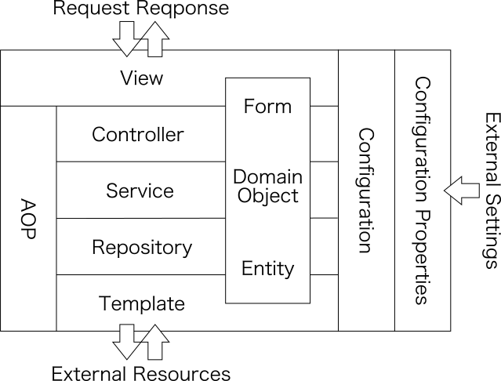
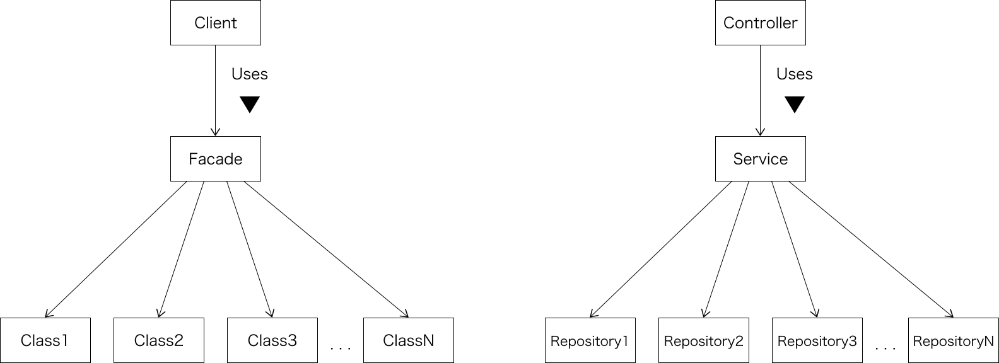

このポストは、[過去にQiitaで書いたもの](https://qiita.com/yo1000/items/a6acbf5f454a7f53aef9)を改訂したものです。

新年度を迎えるたび、Qiitaでのポストへたびたび「いいね」がつくので、入社等をきっかけに、新たな環境ではじめてSpringに触れる方もきっと多いのでしょう。自分の周囲に対しても、Springを説明する際によく使用していたポストだったので、内容の見直しも兼ねて、こちらのサイトに改訂版としてポストしておこうかと。

## レイヤーアーキテクチャ
Springでは各コンポーネントの責務に応じたステレオタイプアノテーションが用意されており、これらがどう連携するかについては、レイヤーアーキテクチャをイメージすると理解しやすいです。

Springでの各責務レイヤーは、以下のように連携します。

## 各レイヤーの責務
各レイヤーの責務と役割、および関連アノテーションを簡単に説明していきます。Springで開発する場合には、先のレイヤーアーキテクチャと、以下で説明する各役割を意識すると良いでしょう。

なお、いくつかのアノテーションは、ドメイン駆動開発にそのヒントを得て用意されているため、ドメイン駆動開発に関する知識を既に有している場合は、直接ドキュメントを当たってみるのも良いでしょう。

### View
Springにおけるビューは、一般的なHTMLページを構築するだけのビューとは異なり、特定のビュー技術に縛られることなく、柔軟にモデルをブラウザでレンダリングできます。

特定のビュー技術に縛られない、ということは、逆に様々なテンプレートエンジンを適用できたり、HTMLページ以外の様々なレスポンスも、ビューとして取り扱えるということを意味します。つまりSpringでのビューとは、HTMLページに限らない、あらゆるレスポンスコンテンツ(JSON, XML, CSV, PDF, etc..)のことを指します。

_関連するアノテーションはありません。_

### Controller
コントローラーは、URLとサービスの呼び出しをマッピングし、リクエスト、およびレスポンスをハンドリングします。

共通的なロギング、例外ハンドリング、リクエスト、レスポンス加工等の横断的関心事については、後述する`@ControllerAdvice`を使用して実装し、コントローラーでは直接実装しません。

関連するアノテーションには、以下のようなものがあります。

- `@Controller`([JavaDoc](https://docs.spring.io/spring-framework/docs/current/javadoc-api/org/springframework/stereotype/Service.html))
- `@RestController`([JavaDoc](https://docs.spring.io/spring-framework/docs/current/javadoc-api/org/springframework/web/bind/annotation/RestController.html))

### Service
サービスは、状態を持たず、独立した操作のみを持ち、コントローラーとリポジトリーの間を取り持ちます。また、ビジネスサービスファサード(いわゆるビジネスロジックのようなもの)として位置づけることも可能です。

なお、ファサードパターンとは、以下のように、複雑な多数のオブジェクト呼び出しを、ファサードによって外部から隠蔽し、一連の手続きを一つの窓口に集約する手法のことで、これはSpringの各責務レイヤーとよくマッチします。

関連するアノテーションには、以下のようなものがあります。

- `@Service`([JavaDoc](https://docs.spring.io/spring-framework/docs/current/javadoc-api/org/springframework/stereotype/Service.html))

### Repository
リポジトリーは、データアクセスを抽象化し、オブジェクトの集合へ格納、取得、検索するかのような振る舞いを提供します。また、旧来のデータアクセスオブジェクトのように位置づけることも可能ですが、データアクセスを抽象化するという役割は必ず果たすようにしてください。

データアクセスが抽象化されることで、特定の永続化技術に縛られることがなくなり、サービスや、コントローラーから見た、リポジトリーのインターフェースは、一元的なデータアクセスの手続きを提供できるようになります。

関連するアノテーションには、以下のようなものがあります。

- `@Repository`([JavaDoc](https://docs.spring.io/spring-framework/docs/current/javadoc-api/org/springframework/stereotype/Repository.html))

### Template
テンプレートは、各種永続化技術を使う上での煩雑な手続きをラップし、使いやすく整えたものです。リポジトリーの具象クラスがこれを使い、外部リソースへの永続化を行ないます。

なお、テンプレートをプロジェクトの開発者が作成することはほとんどありません。多くの場合、Springや、永続化技術を提供しているベンダー、またはそのサプライヤーから、ライブラリとして提供されるため、これを使用します。

_関連するアノテーションはありません。_

### Form
フォームは、リクエストパラメーターや、ビューに割り当てる値を保持するデータモデルです。モデルはPOJOであることが望ましいです。

これは必ずしも必要ではなく、リクエストの内容や、ビューに割り当てる値が、ドメインオブジェクトと同様のデータ構造で表現できる場合、ドメインオブジェクトで代用することができます。

関連するアノテーションには、以下のようなものがあります。

- `@ModelAttribute`([JavaDoc](https://docs.spring.io/spring-framework/docs/current/javadoc-api/org/springframework/web/bind/annotation/ModelAttribute.html))

### Domain Object
ドメインオブジェクトは、開発の中核となる対象領域(特定の業務や、仕組み)を表現するモデルオブジェクトです。

_関連するアノテーションはありません。_

### Entity
エンティティは、リポジトリーが取り扱う集合をなすオブジェクトを表現したものです。モデルはPOJOであることが望ましいです。

これは必ずしも必要ではなく、リポジトリーが永続化するオブジェクトの抽象モデルが、ドメインオブジェクトと同様のデータ構造で表現できる場合、ドメインオブジェクトで代用することができます。

関連するアノテーションには、以下のようなものがあります。

- `@Entity`([JavaDoc](https://docs.oracle.com/javaee/7/api/javax/persistence/Entity.html))

### AOP
AOPはアスペクト指向プログラミングの略称で、横断的関心事(共通的なロギング、例外ハンドリング、メッセージの加工等)を一元的に記述できるようにします。AOPを使用することで、サービスやリポジトリーから、煩雑で共通的な手続きを追い出すことができ、各レイヤーの責務に集中して開発できるようになります。

関連するアノテーションには、以下のようなものがあります。

- `@Aspect`([JavaDoc](http://www.eclipse.org/aspectj/doc/next/aspectj5rt-api/org/aspectj/lang/annotation/Aspect.html))
- `@ControllerAdvice`([JavaDoc](https://docs.spring.io/spring/docs/current/javadoc-api/org/springframework/web/bind/annotation/ControllerAdvice.html))
- `@RestControllerAdvice`([JavaDoc](https://docs.spring.io/spring-framework/docs/current/javadoc-api/org/springframework/web/bind/annotation/RestControllerAdvice.html))

### Configuration
コンフィグレーションは、DIコンテナに登録されるBeanオブジェクトを構成、定義します。これは、旧来のSpringでたびたび使用されていた`applicationContext.xml`を、Javaベースで表現できるようにしたものす。

関連するアノテーションには、以下のようなものがあります。

- `@Configuration`([JavaDoc](https://docs.spring.io/spring-framework/docs/current/javadoc-api/org/springframework/context/annotation/Configuration.html))

### Configuration Properties
コンフィグレーションプロパティは、Beanオブジェクトの構成に必要となるプロパティを、外部化し、これをコンフィグレーションに取り込めるようにします。

関連するアノテーションには、以下のようなものがあります。

- `@ConfigurationProperties`([JavaDoc](https://docs.spring.io/spring-boot/docs/current/api/org/springframework/boot/context/properties/ConfigurationProperties.html))
