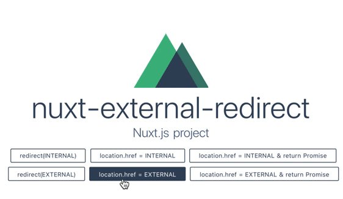

以前からVueには興味があって、このサイトもまあVuePress使っているから、まあそうなんだろうねという感じなんですけど、最近では職場でもVueが使われることが少しずつ増え始めて、今やっているプロジェクトではNuxt.js使うことになったのですよね。

そんな中で、認証基盤(別ドメイン)へのリダイレクトをかけようとしたら、リダイレクトをトリガしているページが一瞬表示されてからリダイレクトが完了する、というなんとも引っかかる動きをしたわけです。今回はこれについて検証して、現行(Nuxt.js 1.4.0時点)では、まずまず妥当と思われる対処法までたどり着いたのでこれを書きます。


## 要件
- NodeJS 9.5.0
- Nuxt.js 1.4.0
  - SPA モード

```con
$ node -v
v9.5.0
```

検証コードをリポジトリにまとめてあるので、詳細についてはこちらの`package.json`を参考に。<br>
https://github.com/yo1000/nuxt-external-redirect


## 現象
まず何が起きるのかでいうと、キャプチャを見てもらうのが早そう。



ここでは作成したデモページから、Nuxt.jsの日本語版公式ページへ、リダイレクトをかけています。このような具合に、本来のリダイレクト先が表示されるより一瞬前に、リダイレクト指示をしているページが一瞬表示されてしまうのです。


## 再現条件
どのような場合に、これが起きるのかというと、以下の条件に合致するだけで発生してしまいます。

- Nuxt.js 1.4.0
- SPAモード
- `middleware`でリダイレクトする
- 公式の `redirect`関数以外を使用してリダイレクト
  - `window.location.href`, `window.location.replace`等を使用する 

たったこれだけです。よくありそうですね。

公式の`redirect`関数を使用した場合は、以下の条件に合致すると、一瞬エラーページが表示されます。

- Nuxt.js 1.4.0
- SPAモード
- `middleware`でリダイレクトする
- 公式の`redirect`関数を使用して外部サイトヘリダイレクト
  - サイト内遷移(`/`配下へのページ遷移)ではエラーは表示されない

今度はリダイレクトを指示しているページではなく、エラー画面が表示されてしまうので、これもまたユーザーには良い印象を与えず、避けたいところです。


## 調査
この現象の発生原因のひとつは`middleware`を使用しているためです。`middleware`は、ドキュメントに記載のある通りの順序で呼び出されますが、保証されているのはその呼び出し順序のみだということです。完了を待機してから次のライフサイクルフェーズに移行するわけではないので、リダイレクト完了するよりも前に、レンダリング結果が一瞬画面に出てしまうということなんですね。

ただまあこんな挙動をそのままにされていては、困るわけです。そこでIssueをあたってみると、以下のようなものが見つかります。

>  https://github.com/nuxt/nuxt.js/issues/2287<br>
> \#2287 NUXT redirect before html rendering

件名からも分かる通り、今回の現象と完全一致しています。ただこのIssueがあげられたのはかなり前で、これはすでに解決されています。どのような解決がされたのかというのを調べてみると、以下のような流れがあったようです。

> https://github.com/nuxt/nuxt.js/pull/2265<br>
> feat: allow redirect to external url #2265

はじめにこの問題に対応したプルリクエストがこれで、この時点では、公式の`redirect`関数を外部サイトに向けて呼び出した場合に、フラグを立て、これをもとにレンダリングを抑制する、という対応をとっています。しかしこの対応ではリダイレクトが完了するまで、レンダリングを待機できているわけではなく、レンダリングされてもいいようなコンテンツにページを置き換えているに過ぎず、完全な対応とは呼べません。また、`layout`を使用している場合、ページのすべてが置き換わるわけではなく、ページの置き換え自体の対応も不完全でした。(とはいえ、何かしらの対処がされたのはこれが最初だったので、その点は大いに感謝したい。)

> https://github.com/nuxt/nuxt.js/commit/de02ea4b5dee0c130867f87043453ddf3da41ea5#diff-31ef755db2806224349111e316424204<br>
> app: Better external url redirect handling

その後、このようなコミットがあり、この時点で公式の`redirect`関数を使用する上での対応としては完全な状態になりました。`Promise`を使用し、ブラウザのリダイレクトを待機するようになり、問題は解決です。

> https://github.com/nuxt/nuxt.js/commit/24185c97e7a8173932b3d6d0ed19799d5e983c38<br>
> fix: redirect without unresolved promise

ところが、話はこれで終わりません。何の気を利かせたのか、その後、エラー報告をするように書き換えるコミットがありました。これにより、公式の`redirect`関数を使用して、外部サイトにリダイレクトをかけようとすると、一瞬エラー画面が表示されるようになってしまいました。

なぜそんなことを。


## 対処法
引っかかる調査結果となりましたが、ひとまずここまでの調査で、どのような対応を取ればよいかはわかりました。`middleware`内で、公式の`redirect`関数を使用せずに、リダイレクトする場合は以下のようにします。

```javascript{numberLines:true}
export default function() {
  window.location.href = 'https://taget-url.local/'
  return new Promise((resolve) => {
    // Wait for broswer to redirect...
  })
}
```

今回の検証に使ったコードはリポジトリにまとめてあるので、再現確認をしてみたい場合は以下をどうぞ。<br>
https://github.com/yo1000/nuxt-external-redirect


## 後日談
この一件、同僚が、なぜ最終的に`Promise`による待機処理が除去されたのか疑問に感じ、[公式フォーラムで質問](https://nuxtjs.cmty.io/clarkdo/hare/issues/c18)してくれていました。結果、ついた回答としては、以下のようなものでした。

> You could use `serverMiddleware` or [nuxt-redirect](https://github.com/nuxt-community/redirect-module) to help you out :)

これらはURLに対して、別の内部URLを与えるもののようで、これによってリダイレクト時に問題の発生しない状態(公式`redirect`関数を使用したサイト内遷移)を作り出してやるのが、公式としてのおすすめのリダイレクト方法、ということのようです。


### nuxt-redirect
どのような設定をすればよいか、例を残しておきます。

はじめに、`@nuxtjs/redirect-module`を依存追加します。

```
$ npm i @nuxtjs/redirect-module --save
```

次に、`nuxt.config.js`へURLのマッピング設定を追加します。

```javascript{numberLines:true}
module.exports = {
  // 中略
  modules: [
    ['@nuxtjs/redirect-module', [
      { from: '^/redirect-in-mod', to: '/index2' },
      { from: '^/redirect-ex-mod', to: 'https://zh.nuxtjs.org' },
    ]],
  ]
}
```

最後に、`middleware`でマッピングしたURLへリダイレクトします。

```javascript{numberLines:true}
export default function({ redirect }) {
  redirect('/redirect-ex-mod')
}
```


### まとめ
以上のことから、リダイレクトを行う場合は、状況に合わせて以下のような対応を行うのが良いでしょう。

- 公式`redirect`関数によるリダイレクト
  - 内部URLへ遷移: そのまま遷移
  - 外部URLへ遷移: `serverMiddleware`や[nuxt-redirect](https://github.com/nuxt-community/redirect-module)を使用して内部URLを与えて遷移
- その他の方法でリダイレクト(ライブラリなどを使用していて避けられない場合)
  - リダイレクト後に`Promise`を使用して完了を待機
