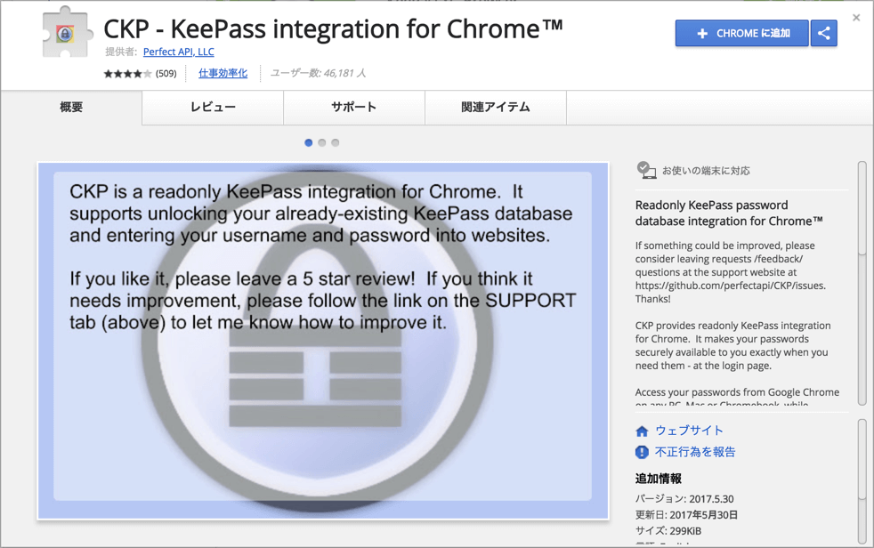

[1Password](https://1password.com/)の課金モデル変更に伴い、サブスクリプションモデルに移行するか、[LastPass](https://www.lastpass.com/ja)に移行するかと、これからのパスワード管理について、いろいろ悩んで改めてゼロから調べ直してみたところ、[KeePass](https://keepass.info/)というのが良さそうだったのでこれに移行してみました。

## KeePassとは
KeePassは、OSSのパスワードマネージャです。OSSなので、当然仕様は公開されています。そのため、これに従うことで、サードパーティのクライアントからでもKeePassのパスワードデータベースに安全にアクセスすることができます。(当然データベースは暗号化されており、復号にはユーザーからのマスターパスワードの入力が必要になります)

KeePassでは、パスワードデータベースファイルの管理は、ユーザーに委ねられています。そのため、複数デバイス間でこれを共有したい場合は、自分の信頼しているクラウドストレージや、任意の共有方法を選択できます。

## クライアント
クライアントは複数存在しますが、複数存在するが故、これといった正解がなく、迷います。いくつか使ってみた中で、良いと感じたものを用途ごとに書いてみます。

### Macアプリ
多機能なものか、ビジュアルがきれいに整ったものかで、有力候補は二択。

#### KeeWeb
ビジュアルがきれいに整った方。1Passwordとほとんど同じUIなうえ、小奇麗さでいえば1Passwordを上回っているのでChrome拡張にKeePassXCを使わない場合は、これが最有力候補。

https://keeweb.info/

#### KeePassXC
多機能な方。CSVインポート機能なども備えており、移行にも使える。UI的には昔ながらのわかりやすさはあれど、古臭さを感じる。

https://keepassxc.org/

### Chrome拡張
パスワードをブラウザに連携するための手段は複数用意されています。概ね以下の3種類があります。

- ブラウザ拡張とKeePassHTTPローカルサーバが連携するタイプ
- ブラウザ拡張とクラウドストレージが連携するタイプ
- ブラウザ拡張とデスクトップアプリが連携するタイプ

クラウドストレージ連携か、デスクトップアプリ連携かで、有力候補は二択。

#### CKP - KeePass integration for Chrome
ブラウザ拡張とクラウドストレージが連携するタイプ。ブラウザ拡張からGoogleDriveやDropboxへログインして、そこに保存されたパスワードデータベースと連携します。ファイルが更新されると定期的に同期されて最新化されます。

また、クラウドストレージ以外にもローカルファイルをブラウザに読み込ませることも可能ですが、この場合は定期的に手動で再読み込みさせないと最新化されません。

https://chrome.google.com/webstore/detail/ckp-keepass-integration-f/lnfepbjehgokldcaljagbmchhnaaogpc

#### KeePassKC Browser
ブラウザ拡張とデスクトップアプリが連携するタイプ。名前の通りKeePassXCと連携します。デスクトップアプリが起動していないと連携できなかったりするのが、かなり不便。

https://chrome.google.com/webstore/detail/keepassxc-browser/oboonakemofpalcgghocfoadofidjkkk

### Androidアプリ
いくつか使ってみましたが、使い勝手でいうと、Keepass2Anroid一択。

#### Keepass2Android
1Password等、有名どころのパスワードマネージャ同様に、スクリーンショットは撮れないようになっていたためキャプチャはなし。

指紋認証によるロックの解除や、シンプルなUIで直感的に使えます。

https://play.google.com/store/apps/details?id=keepass2android.keepass2android

### まとめ
クライアントとしては、以下の組み合わせがストレスなく使えて良さそうでした。

- KeeWeb
- CKP
- Keepass2Android

## 移行作業
移行は思った以上に簡単ですぐに終わります。今回は1Passwordから、KeePassへの移行を例にします。

### 要件
用意するものは以下。

- 1Password
- KeePassXC

### 手順
CSVエクスポートをして、インポートをするのみなので、非常にわかりやすいです。

注意点としては、1PasswordからCSVエクスポートするときに、ゴミ箱にアイテムが残っていると、これも含めてエクスポートされてしまうので、不要であれば事前に削除しておくことくらいでしょうか。

#### CSVエクスポート
ここでは1Passwordからの移行を例にしていますが、CSVエクスポート機能があるパスワードマネージャであれば、概ねどのパスワードマネージャからでも近い手順で移行できるはずです。

1. 1Passwordのメニューバーから、[エクスポート] > [すべてのアイテム]を選択します。
2. [ファイル形式]を、`カンマ区切りテキスト (.csv)`に変更して、列の出力順をドラッグして、キャプチャのように変更して、[保存]します。(列の順番を変更しておくと、インポートが楽になります)

#### CSVインポート
CSVインポート機能を備えている、KeePassXCにお世話になります。わたしはインポートのためだけにKeePassXCを使い、移行後は使っていません。

1. KeePassXCのメニューバーから、[データベース] > [インポート] > [CSV ファイルをインポート...]を選択します。
2. [パスワードを入力]、および[パスワードを再入力]に、これから作成するパスワードデータベースに設定したい、マスターパスワードを入力します。
3. インポート内容の確認画面が表示されるので、問題なければ[OK]をクリックしてインポート完了です。
4. 直後の画面で、[データベースの書込みに失敗しました。]という不吉なメッセージが表示されますが、これはまだパスワードデータベースファイルが存在しないためなので、名前をつけて保存します。メニューバーから、[データベースを別名で保存...]を選択して保存してください。

以上で、パスワードマネージャの移行は完了です。パスワードデータベースファイルが手元に作成されたので、以降はKeePassXCを使用せず、他のKeePassクライアントでこのファイルを読み込めば、好きなクライアントを使えるようになります。
