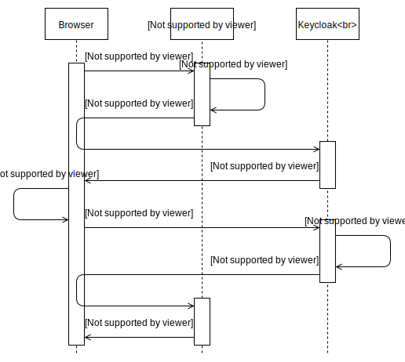
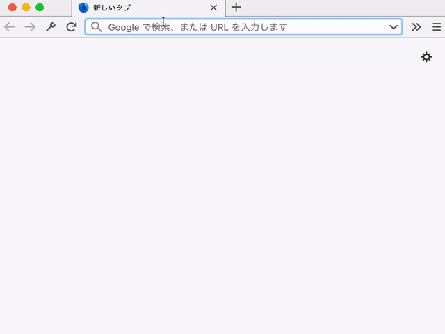

つい先日、待ちに待ったKeycloak 4がいよいよリリースされました。なぜ待っていたかというと、Keycloak 4用の連携モジュールからはSpring Boot 2に正式対応されるからなんですね。(Keycloak 3用の連携モジュールはSpring Boot 1系にしか対応していませんでした。)Keycloak 3の頃からIssueはあがっておりましたが、Keycloak開発チームから、Keycloak 4のリリースと一緒に対応するよ、といった回答がされており、これを待っておりました。

やっと材料が出揃ったということで、さっそくこれらを連携させたサンプルを確認していきたいと思います。実現したいSSOのフローに応じて、2回に分けて書きます。なお、文章はサンプルプロジェクトの内容を追いながら書いていくので、以下も併せて確認してください。<br>
https://github.com/yo1000/kc4-boot2


## 要件
### 環境
今回の作業環境は以下のとおりです。

- Java 1.8
- Kotlin 1.2.41
- Spring Boot 2.0.3.RELEASE
- Keycloak 4.0.0.Final


### 認証認可フロー
今回は、SSOクライアントが単一の、最もシンプルな認証の流れを確認していきます。以下のような認証フローをイメージしてください。




## Keycloakのセットアップ
Keycloak 3は、Keycloak 4へメジャーバージョンアップを果たしましたが、基本的な使い方は以前のバージョンと大きく変更はありません。

ここでは、Keycloakをセットアップするために用意したスクリプトを見ながら、どのような操作が必要になるのか確認していきます。

https://github.com/yo1000/kc4-boot2/blob/master/kc4.setup.sh

```bash{numberLines:true}
#!/usr/bin/env bash

cd `dirname $0`
DIR=`pwd`

## 作業ディレクトリを作成
if [ ! -d keycloak ]; then
  mkdir keycloak
fi
cd keycloak

## Keycloakのダウンロード
if [ ! -d keycloak-4.0.0.Final ]; then
  curl -O https://downloads.jboss.org/keycloak/4.0.0.Final/keycloak-4.0.0.Final.tar.gz
  tar -zxvf keycloak-4.0.0.Final.tar.gz
fi
cd keycloak-4.0.0.Final

## すでにKeycloakが起動済みの場合はセットアップを中断
if [ -n "`ps x | grep keycloak | grep -v grep`" ]; then
  echo 'Keycloak has already started.'
  exit 1
fi

## すでに8080ポートが使用済みの場合はセットアップを中断
if [ -n "`netstat -an | grep LISTEN | awk '{print $4}' | grep '.8080'`" ]; then
  echo 'Port 8080 has already used by another process.'
  exit 1
fi

## Wildflyの管理ユーザーを作成
bin/add-user.sh \
  -u wildfly \
  -p wildfly1234

## Keycloakの管理ユーザーを作成
bin/add-user-keycloak.sh \
  -r master \
  -u keycloak \
  -p keycloak1234

## Keycloakを起動, Bindポートに0.0.0.0を指定
bin/standalone.sh \
  -b 0.0.0.0 &

## Keycloakが起動するまで待機
while [ -z "`netstat -an | grep '127.0.0.1.9990' | grep LISTEN`" ]; do sleep 10; done; echo "keycloak ok"

## Keycloakにログイン
bin/kcadm.sh config credentials \
  --server http://127.0.0.1:8080/auth \
  --realm master \
  --user keycloak \
  --password keycloak1234

## 変数を設定 (以降のコマンドで使用)
readonly REALM="kc4-boot2"
readonly ROLE_ADMIN="admin"
readonly ROLE_USER="user"
readonly USERNAME_ADMIN="alice"
readonly USERNAME_USER="bob"
readonly CLIENT_RESOURCE_SERVER="${REALM}-server"
readonly CLIENT_RESOURCE_CLIENT="${REALM}-client"
readonly ALLOW_REDIRECT_FROM1="http://127.0.0.1:8081/*"
readonly ALLOW_REDIRECT_FROM2="http://localhost:8081/*"

## Realmを作成
# RealmはKeycloakでの認証基盤の管理単位
# Keycloakは1つのインスタンス上に複数の認証基盤を構築できる
bin/kcadm.sh create realms \
  -s realm=${REALM} \
  -s enabled=true

## Roleを作成
# RoleはUserやGroupに役割名を設定するためのもの
# Role単体では名前以上の意味を持たないが,
# この名前を使って操作の可否を設定していくことで認可管理をする
bin/kcadm.sh create roles \
  -r ${REALM} \
  -s name=${ROLE_ADMIN}
bin/kcadm.sh create roles \
  -r ${REALM} \
  -s name=${ROLE_USER}

## Userの作成
# 今回はRoleの異なる2つのユーザーを作成する
bin/kcadm.sh create users \
  -r ${REALM} \
  -s username=${USERNAME_ADMIN} \
  -s enabled=true
bin/kcadm.sh create users \
  -r ${REALM} \
  -s username=${USERNAME_USER} \
  -s enabled=true

## Passwordの更新
# 初期状態ではPasswordが設定されておらず, 設定するまではログインができない
bin/kcadm.sh set-password \
  -r ${REALM} \
  --username ${USERNAME_ADMIN} \
  -p "${USERNAME_ADMIN}1234"
bin/kcadm.sh set-password \
  -r ${REALM} \
  --username ${USERNAME_USER} \
  -p "${USERNAME_USER}1234"

## UserにRoleを設定する
# 初期状態ではRoleが設定されておらず, 設定するまでは認可制御ができない
bin/kcadm.sh add-roles \
  -r ${REALM} \
  --uusername ${USERNAME_ADMIN} \
  --rolename ${ROLE_ADMIN} \
  --rolename ${ROLE_USER}
bin/kcadm.sh add-roles \
  -r ${REALM} \
  --uusername ${USERNAME_USER} \
  --rolename ${ROLE_USER}

## Clientの作成
# ClientはKeycloakを使用するアプリケーションの構成単位
# 例えば, Keycloakを使用するアプリケーションが,
# APIアプリケーションであればAPIアプリケーションとしての構成を,
# GUIアプリケーションであればGUIアプリケーションとしての構成を, それぞれ設定していく
# 同じ設定が使い回せるアプリケーション同士は同じClientを使う
# 今回は, API用, GUI用のClientを作成するが, この記事ではGUI用のみを使う
RES_SRV_ID=`bin/kcadm.sh create clients -r ${REALM} -s clientId=${CLIENT_RESOURCE_SERVER} -s bearerOnly=true -i`; \
  echo "Created new client with id '${RES_SRV_ID}'"
# GUIアプリケーションの場合, Keycloakにリダイレクトしてくるため
# どのURLからのリダイレクトを受け付けるのか設定が必要になる (redirectUris)
RES_CLI_ID=`bin/kcadm.sh create clients -r ${REALM} \
  -s clientId=${CLIENT_RESOURCE_CLIENT} \
  -s "redirectUris=[\"${ALLOW_REDIRECT_FROM1}\", \"${ALLOW_REDIRECT_FROM2}\"]" -i`; \
  echo "Created new client with id '${RES_CLI_ID}'"

## keycloak.jsonのインストール
# Keycloakとアプリケーションを疎通させるためには,
# Keycloakに登録されたClientアプリケーションであることを証明するための資格情報を
# Keycloakから取得して, アプリケーションに組み込む必要がある
bin/kcadm.sh get \
  clients/${RES_SRV_ID}/installation/providers/keycloak-oidc-keycloak-json \
  -r ${REALM}
bin/kcadm.sh get \
  clients/${RES_CLI_ID}/installation/providers/keycloak-oidc-keycloak-json \
  -r ${REALM} >"${DIR}/src/main/resources/keycloak.json"
```

スクリプトの準備ができたら、実行しておきます。なお、スクリプト内でKeycloakバイナリをダウンロードするため、低速回線を使用している場合は、注意してスクリプトを使用してください。

```
./kc4.setup.sh
```

以上のような流れでKeycloakを構成していきます。Keycloakの構成はGUIからもできますが、Admin CLI経由で操作できるようになっておくと、構成管理に乗せやすかったり、再現性を高められたりするので良いです。Admin CLIについての詳しい内容は以下を確認してください。

https://www.keycloak.org/docs/latest/server_admin/index.html#the-admin-cli


## SSOクライアントアプリの設定
アプリケーションに必要な依存と、設定の確認をします。

まず依存関係に、Keycloak 4.0と、Spring Boot 2.0に関係するものを追加します。重要な箇所はハイライトしてありますが、その中でも`keycloak-spring-boot-2-starter`は、Spring Boot 2.0への対応によって公開された新しいパッケージなので特に重要な部分です。なお、Spring Boot 1.x向けには`keycloak-spring-boot-starter`がすでに存在しているため、取り違えないように注意してください。

https://github.com/yo1000/kc4-boot2/blob/master/pom.xml

```xml{numberLines:true}{14-19,51-55,70-78}
<?xml version="1.0" encoding="UTF-8"?>
<project xmlns="http://maven.apache.org/POM/4.0.0" xmlns:xsi="http://www.w3.org/2001/XMLSchema-instance"
	xsi:schemaLocation="http://maven.apache.org/POM/4.0.0 http://maven.apache.org/xsd/maven-4.0.0.xsd">
	<modelVersion>4.0.0</modelVersion>

	<groupId>com.yo1000</groupId>
	<artifactId>kc4-boot2</artifactId>
	<version>0.0.1-SNAPSHOT</version>
	<packaging>jar</packaging>

	<name>kc4-boot2</name>
	<description>Demo project for Spring Boot</description>

	<parent>
		<groupId>org.springframework.boot</groupId>
		<artifactId>spring-boot-starter-parent</artifactId>
		<version>2.0.3.RELEASE</version>
		<relativePath/> <!-- lookup parent from repository -->
	</parent>

	<properties>
		<project.build.sourceEncoding>UTF-8</project.build.sourceEncoding>
		<project.reporting.outputEncoding>UTF-8</project.reporting.outputEncoding>
		<java.version>1.8</java.version>
		<kotlin.version>1.2.41</kotlin.version>
	</properties>

	<dependencies>
		<dependency>
			<groupId>org.springframework.boot</groupId>
			<artifactId>spring-boot-starter-security</artifactId>
		</dependency>
		<dependency>
			<groupId>org.springframework.boot</groupId>
			<artifactId>spring-boot-starter-web</artifactId>
		</dependency>
		<dependency>
			<groupId>com.fasterxml.jackson.module</groupId>
			<artifactId>jackson-module-kotlin</artifactId>
		</dependency>
		<dependency>
			<groupId>org.jetbrains.kotlin</groupId>
			<artifactId>kotlin-stdlib-jdk8</artifactId>
		</dependency>
		<dependency>
			<groupId>org.jetbrains.kotlin</groupId>
			<artifactId>kotlin-reflect</artifactId>
		</dependency>

		<!-- https://mvnrepository.com/artifact/org.keycloak/keycloak-spring-boot-2-starter -->
		<dependency>
			<groupId>org.keycloak</groupId>
			<artifactId>keycloak-spring-boot-2-starter</artifactId>
			<version>4.0.0.Final</version>
		</dependency>

		<dependency>
			<groupId>org.springframework.boot</groupId>
			<artifactId>spring-boot-starter-test</artifactId>
			<scope>test</scope>
		</dependency>
		<dependency>
			<groupId>org.springframework.security</groupId>
			<artifactId>spring-security-test</artifactId>
			<scope>test</scope>
		</dependency>
	</dependencies>

	<dependencyManagement>
		<dependencies>
			<dependency>
				<groupId>org.keycloak.bom</groupId>
				<artifactId>keycloak-adapter-bom</artifactId>
				<version>4.0.0.Final</version>
				<type>pom</type>
				<scope>import</scope>
			</dependency>
		</dependencies>
	</dependencyManagement>

	<build>
		<sourceDirectory>${project.basedir}/src/main/kotlin</sourceDirectory>
		<testSourceDirectory>${project.basedir}/src/test/kotlin</testSourceDirectory>
		<plugins>
			<plugin>
				<groupId>org.springframework.boot</groupId>
				<artifactId>spring-boot-maven-plugin</artifactId>
			</plugin>
			<plugin>
				<artifactId>kotlin-maven-plugin</artifactId>
				<groupId>org.jetbrains.kotlin</groupId>
				<configuration>
					<args>
						<arg>-Xjsr305=strict</arg>
					</args>
					<compilerPlugins>
						<plugin>spring</plugin>
					</compilerPlugins>
				</configuration>
				<dependencies>
					<dependency>
						<groupId>org.jetbrains.kotlin</groupId>
						<artifactId>kotlin-maven-allopen</artifactId>
						<version>${kotlin.version}</version>
					</dependency>
				</dependencies>
			</plugin>
		</plugins>
	</build>
</project>
```

次にSpring Bootではおなじみの`application.yml`を設定します。`keycloak.json`の内容と一部重複しますが、こちらにもKeycloakの設定が必要になります。

https://github.com/yo1000/kc4-boot2/blob/master/src/main/resources/application.yml

```yaml
server:
  port: 8081

## Refs.
## https://www.keycloak.org/docs/latest/securing_apps/index.html#_spring_boot_adapter
keycloak:
  # KeycloakのRealm
  realm: kc4-boot2
  # KeycloakのベースURL
  auth-server-url: http://127.0.0.1:8080/auth
  # KeycloakのClient名
  resource: kc4-boot2-client
```


## SSOクライアントアプリの作成
実際にアプリケーションを作成していきます。

とくに気をつけて設定しなければならないのが、ハイライトしてあるConfigurationクラスの部分です。ここでKeycloakから受け取った認証情報を、アプリケーション内でどのように扱うかを設定していきます。

https://github.com/yo1000/kc4-boot2/blob/master/src/main/kotlin/com/yo1000/kc4boot2/Kc4Boot2Application.kt

```kotlin{numberLines:true}{29-47}
package com.yo1000.kc4boot2

import org.keycloak.adapters.AdapterDeploymentContext
import org.keycloak.adapters.springsecurity.AdapterDeploymentContextFactoryBean
import org.keycloak.adapters.springsecurity.KeycloakConfiguration
import org.keycloak.adapters.springsecurity.config.KeycloakWebSecurityConfigurerAdapter
import org.keycloak.adapters.springsecurity.token.KeycloakAuthenticationToken
import org.springframework.boot.autoconfigure.SpringBootApplication
import org.springframework.boot.runApplication
import org.springframework.core.io.ClassPathResource
import org.springframework.security.config.annotation.authentication.builders.AuthenticationManagerBuilder
import org.springframework.security.config.annotation.web.builders.HttpSecurity
import org.springframework.security.core.authority.mapping.SimpleAuthorityMapper
import org.springframework.security.core.session.SessionRegistryImpl
import org.springframework.security.web.authentication.session.RegisterSessionAuthenticationStrategy
import org.springframework.security.web.authentication.session.SessionAuthenticationStrategy
import org.springframework.web.bind.annotation.GetMapping
import org.springframework.web.bind.annotation.RestController

@SpringBootApplication
class Kc4Boot2Application

fun main(args: Array<String>) {
    runApplication<Kc4Boot2Application>(*args)
}

@KeycloakConfiguration
class SecurityConfig : KeycloakWebSecurityConfigurerAdapter() {
    // SSO基盤へのリダイレクトによってアプリケーションの認証を連携される場合は
    // RegisterSessionAuthenticationStrategy を設定する
    override fun sessionAuthenticationStrategy(): SessionAuthenticationStrategy = RegisterSessionAuthenticationStrategy(
            SessionRegistryImpl())

    // 先の手順でKeycloakから取得したkeycloak.jsonを
    // クラスパスルートから取得できるように設定を変更する
    // デフォルトではWEB-INF/keycloak.jsonから取得するようになっており都合が悪い
    override fun adapterDeploymentContext(): AdapterDeploymentContext = AdapterDeploymentContextFactoryBean(
            ClassPathResource("keycloak.json")).also { it.afterPropertiesSet() }.`object`!!

    // Keycloakから連携されるロール名を大文字に変換する
    override fun configure(auth: AuthenticationManagerBuilder?) {
        auth!!.authenticationProvider(keycloakAuthenticationProvider().also {
            it.setGrantedAuthoritiesMapper(SimpleAuthorityMapper().also {
                it.setConvertToUpperCase(true)
            })
        })
    }

    override fun configure(http: HttpSecurity) {
        super.configure(http)
        http.authorizeRequests()
                .antMatchers("/sso/login*").permitAll()
                .antMatchers("/customers*").hasAnyRole("USER")
                .antMatchers("/admin*").hasAnyRole("ADMIN")
                .anyRequest().permitAll();
        http.csrf().disable()
    }
}

@RestController
class Kc4Controller {
    @GetMapping("/customers")
    fun getCustomers(token: KeycloakAuthenticationToken): Any = """
        <h1>customers</h1>
        <p><code>
        ${token}
        </code></p>
        <ul>
        <li><code>${token.name}</code></li>
        <li><code>${token.account.keycloakSecurityContext.token.preferredUsername}</code></li>
        </ul>
        """.trimIndent()

    @GetMapping("/admin")
    fun getAdmin(token: KeycloakAuthenticationToken): Any = """
        <h1>admin</h1>
        <p><code>
        ${token}
        </code></p>
        <ul>
        <li><code>${token.name}</code></li>
        <li><code>${token.account.keycloakSecurityContext.token.preferredUsername}</code></li>
        </ul>
        """.trimIndent()
}
```


## SSOクライアントアプリの起動と確認
ここまで準備ができたら、アプリケーションを起動して動作を確認してみます。先の手順でKeycloakはすでに起動しているはずなので、ここではアプリケーションのみを起動します。

```bash
./mvnw clean spring-boot:run
```

アプリケーションが起動したら、[http://127.0.0.1/admin](http://127.0.0.1/admin)にアクセスしてログインします。Keycloakを経由して、認証情報を取得できましたね!!



たったこれだけで冒頭のシーケンス図を実現できたことになります。Keycloak便利ですね。
