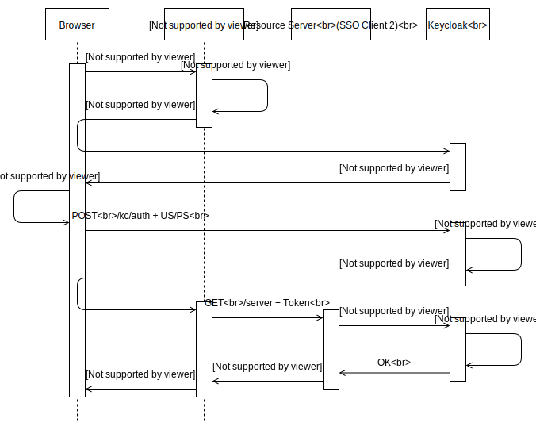
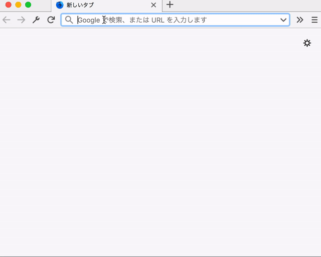

Keycloak 4がリリースされたのに合わせて`keycloak-spring-boot-2-starter`もリリースされたので、Spring Boot 2との連携例を紹介しようという記事の2回目です。([1回目はこちら](2018-06-24-keycloak4-springboot2-simple.html))

https://github.com/yo1000/kc4-boot2-resource


## 要件
### 環境
今回の作業環境は以下のとおりです。

- Java 1.8
- Kotlin 1.2.41
- Spring Boot 2.0.3.RELEASE
- Keycloak 4.0.0.Final


### 認証認可フロー
今回は、SSOクライアントが複数で、それぞれがリソースサーバーとリソースクライアントの関係にある認証の流れを確認していきます。以下のような認証フローをイメージしてください。




## Keycloakのセットアップ
Keycloak 3から、Keycloak 4への移行によって、基本的な使い方に大きな変更が生じないのは、構成が変わっても同様です。

ここでは[以前の投稿](2018-06-24-keycloak4-springboot2-simple.html)同様に、Keycloakをセットアップするために用意したスクリプトを見ながら、どのような操作が必要になるのか確認していきます。(最後の`keycloak.json`をインストールする箇所以外は同じ内容です)

https://github.com/yo1000/kc4-boot2-resource/blob/master/kc4.setup.sh

```bash{numberLines:true}
#!/usr/bin/env bash

cd `dirname $0`
DIR=`pwd`

## 作業ディレクトリを作成
if [ ! -d keycloak ]; then
  mkdir keycloak
fi
cd keycloak

## Keycloakのダウンロード
if [ ! -d keycloak-4.0.0.Final ]; then
  curl -O https://downloads.jboss.org/keycloak/4.0.0.Final/keycloak-4.0.0.Final.tar.gz
  tar -zxvf keycloak-4.0.0.Final.tar.gz
fi
cd keycloak-4.0.0.Final

## すでにKeycloakが起動済みの場合はセットアップを中断
if [ -n "`ps x | grep keycloak | grep -v grep`" ]; then
  echo 'Keycloak has already started.'
  exit 1
fi

## すでに8080ポートが使用済みの場合はセットアップを中断
if [ -n "`netstat -an | grep LISTEN | awk '{print $4}' | grep '.8080'`" ]; then
  echo 'Port 8080 has already used by another process.'
  exit 1
fi

## Wildflyの管理ユーザーを作成
bin/add-user.sh \
  -u wildfly \
  -p wildfly1234

## Keycloakの管理ユーザーを作成
bin/add-user-keycloak.sh \
  -r master \
  -u keycloak \
  -p keycloak1234

## Keycloakを起動, Bindポートに0.0.0.0を指定
bin/standalone.sh \
  -b 0.0.0.0 &

## Keycloakが起動するまで待機
while [ -z "`netstat -an | grep '127.0.0.1.9990' | grep LISTEN`" ]; do sleep 10; done; echo "keycloak ok"

## Keycloakにログイン
bin/kcadm.sh config credentials \
  --server http://127.0.0.1:8080/auth \
  --realm master \
  --user keycloak \
  --password keycloak1234

## 変数を設定 (以降のコマンドで使用)
readonly REALM="kc4-boot2"
readonly ROLE_ADMIN="admin"
readonly ROLE_USER="user"
readonly USERNAME_ADMIN="alice"
readonly USERNAME_USER="bob"
readonly CLIENT_RESOURCE_SERVER="${REALM}-server"
readonly CLIENT_RESOURCE_CLIENT="${REALM}-client"
readonly ALLOW_REDIRECT_FROM1="http://127.0.0.1:8081/*"
readonly ALLOW_REDIRECT_FROM2="http://localhost:8081/*"

## Realmを作成
# RealmはKeycloakでの認証基盤の管理単位
# Keycloakは1つのインスタンス上に複数の認証基盤を構築できる
bin/kcadm.sh create realms \
  -s realm=${REALM} \
  -s enabled=true

## Roleを作成
# RoleはUserやGroupに役割名を設定するためのもの
# Role単体では名前以上の意味を持たないが,
# この名前を使って操作の可否を設定していくことで認可管理をする
bin/kcadm.sh create roles \
  -r ${REALM} \
  -s name=${ROLE_ADMIN}
bin/kcadm.sh create roles \
  -r ${REALM} \
  -s name=${ROLE_USER}

## Userの作成
# 今回はRoleの異なる2つのユーザーを作成する
bin/kcadm.sh create users \
  -r ${REALM} \
  -s username=${USERNAME_ADMIN} \
  -s enabled=true
bin/kcadm.sh create users \
  -r ${REALM} \
  -s username=${USERNAME_USER} \
  -s enabled=true

## Passwordの更新
# 初期状態ではPasswordが設定されておらず, 設定するまではログインができない
bin/kcadm.sh set-password \
  -r ${REALM} \
  --username ${USERNAME_ADMIN} \
  -p "${USERNAME_ADMIN}1234"
bin/kcadm.sh set-password \
  -r ${REALM} \
  --username ${USERNAME_USER} \
  -p "${USERNAME_USER}1234"

## UserにRoleを設定する
# 初期状態ではRoleが設定されておらず, 設定するまでは認可制御ができない
bin/kcadm.sh add-roles \
  -r ${REALM} \
  --uusername ${USERNAME_ADMIN} \
  --rolename ${ROLE_ADMIN} \
  --rolename ${ROLE_USER}
bin/kcadm.sh add-roles \
  -r ${REALM} \
  --uusername ${USERNAME_USER} \
  --rolename ${ROLE_USER}

## Clientの作成
# ClientはKeycloakを使用するアプリケーションの構成単位
# 例えば, Keycloakを使用するアプリケーションが,
# APIアプリケーションであればAPIアプリケーションとしての構成を,
# GUIアプリケーションであればGUIアプリケーションとしての構成を, それぞれ設定していく
# 同じ設定が使い回せるアプリケーション同士は同じClientを使う
# 今回は, API用, GUI用のClientを作成するが, この記事ではGUI用のみを使う
RES_SRV_ID=`bin/kcadm.sh create clients -r ${REALM} -s clientId=${CLIENT_RESOURCE_SERVER} -s bearerOnly=true -i`; \
  echo "Created new client with id '${RES_SRV_ID}'"
# GUIアプリケーションの場合, Keycloakにリダイレクトしてくるため
# どのURLからのリダイレクトを受け付けるのか設定が必要になる (redirectUris)
RES_CLI_ID=`bin/kcadm.sh create clients -r ${REALM} \
  -s clientId=${CLIENT_RESOURCE_CLIENT} \
  -s "redirectUris=[\"${ALLOW_REDIRECT_FROM1}\", \"${ALLOW_REDIRECT_FROM2}\"]" -i`; \
  echo "Created new client with id '${RES_CLI_ID}'"

## keycloak.jsonのインストール
# Keycloakとアプリケーションを疎通させるためには,
# Keycloakに登録されたClientアプリケーションであることを証明するための資格情報を
# Keycloakから取得して, アプリケーションに組み込む必要がある
bin/kcadm.sh get \
  clients/${RES_SRV_ID}/installation/providers/keycloak-oidc-keycloak-json \
  -r ${REALM} >"${DIR}/kc4-boot2-resource-server/src/main/resources/keycloak.json"
bin/kcadm.sh get \
  clients/${RES_CLI_ID}/installation/providers/keycloak-oidc-keycloak-json \
  -r ${REALM} >"${DIR}/kc4-boot2-resource-client/src/main/resources/keycloak.json"
```

スクリプトの準備ができたら、実行しておきます。なお、スクリプト内でKeycloakバイナリをダウンロードするため、低速・小容量回線を使用している場合は、注意してスクリプトを使用してください。

```
./kc4.setup.sh
```

以上のような流れでKeycloakを構成していきます。[以前の投稿](2018-06-24-keycloak4-springboot2-simple.html)とほとんど同じなので、あえて再掲する必要はなかったかもしれませんが、念のため。Admin CLIについての詳しい内容は以下を確認してください。

https://www.keycloak.org/docs/latest/server_admin/index.html#the-admin-cli


## SSOクライアントアプリの設定
アプリケーションに必要な依存と、設定の確認をします。

[以前の投稿](2018-06-24-keycloak4-springboot2-simple.html)同様に、まず依存関係に、Keycloak 4と、SpringBoot 2に関係するものを追加します。リソースサーバー、リソースクライアントともに依存内容自体は同じなので、ここではリソースクライアント側の依存構成のみ掲載します。

https://github.com/yo1000/kc4-boot2-resource/blob/master/kc4-boot2-resource-client/pom.xml

```xml{numberLines:true}{14-19,51-55,70-78}
<?xml version="1.0" encoding="UTF-8"?>
<project xmlns="http://maven.apache.org/POM/4.0.0" xmlns:xsi="http://www.w3.org/2001/XMLSchema-instance"
	xsi:schemaLocation="http://maven.apache.org/POM/4.0.0 http://maven.apache.org/xsd/maven-4.0.0.xsd">
	<modelVersion>4.0.0</modelVersion>

	<groupId>com.yo1000</groupId>
	<artifactId>kc4-boot2-resource-client</artifactId>
	<version>0.0.1-SNAPSHOT</version>
	<packaging>jar</packaging>

	<name>kc4-boot2-resource-client</name>
	<description>Demo project for Spring Boot</description>

	<parent>
		<groupId>org.springframework.boot</groupId>
		<artifactId>spring-boot-starter-parent</artifactId>
		<version>2.0.3.RELEASE</version>
		<relativePath/> <!-- lookup parent from repository -->
	</parent>

	<properties>
		<project.build.sourceEncoding>UTF-8</project.build.sourceEncoding>
		<project.reporting.outputEncoding>UTF-8</project.reporting.outputEncoding>
		<java.version>1.8</java.version>
		<kotlin.version>1.2.41</kotlin.version>
	</properties>

	<dependencies>
		<dependency>
			<groupId>org.springframework.boot</groupId>
			<artifactId>spring-boot-starter-security</artifactId>
		</dependency>
		<dependency>
			<groupId>org.springframework.boot</groupId>
			<artifactId>spring-boot-starter-web</artifactId>
		</dependency>
		<dependency>
			<groupId>com.fasterxml.jackson.module</groupId>
			<artifactId>jackson-module-kotlin</artifactId>
		</dependency>
		<dependency>
			<groupId>org.jetbrains.kotlin</groupId>
			<artifactId>kotlin-stdlib-jdk8</artifactId>
		</dependency>
		<dependency>
			<groupId>org.jetbrains.kotlin</groupId>
			<artifactId>kotlin-reflect</artifactId>
		</dependency>

		<!-- https://mvnrepository.com/artifact/org.keycloak/keycloak-spring-boot-2-starter -->
		<dependency>
			<groupId>org.keycloak</groupId>
			<artifactId>keycloak-spring-boot-2-starter</artifactId>
			<version>4.0.0.Final</version>
		</dependency>

		<dependency>
			<groupId>org.springframework.boot</groupId>
			<artifactId>spring-boot-starter-test</artifactId>
			<scope>test</scope>
		</dependency>
		<dependency>
			<groupId>org.springframework.security</groupId>
			<artifactId>spring-security-test</artifactId>
			<scope>test</scope>
		</dependency>
	</dependencies>

	<dependencyManagement>
		<dependencies>
			<dependency>
				<groupId>org.keycloak.bom</groupId>
				<artifactId>keycloak-adapter-bom</artifactId>
				<version>4.0.0.Final</version>
				<type>pom</type>
				<scope>import</scope>
			</dependency>
		</dependencies>
	</dependencyManagement>

	<build>
		<sourceDirectory>${project.basedir}/src/main/kotlin</sourceDirectory>
		<testSourceDirectory>${project.basedir}/src/test/kotlin</testSourceDirectory>
		<plugins>
			<plugin>
				<groupId>org.springframework.boot</groupId>
				<artifactId>spring-boot-maven-plugin</artifactId>
			</plugin>
			<plugin>
				<artifactId>kotlin-maven-plugin</artifactId>
				<groupId>org.jetbrains.kotlin</groupId>
				<configuration>
					<args>
						<arg>-Xjsr305=strict</arg>
					</args>
					<compilerPlugins>
						<plugin>spring</plugin>
					</compilerPlugins>
				</configuration>
				<dependencies>
					<dependency>
						<groupId>org.jetbrains.kotlin</groupId>
						<artifactId>kotlin-maven-allopen</artifactId>
						<version>${kotlin.version}</version>
					</dependency>
				</dependencies>
			</plugin>
		</plugins>
	</build>
</project>
```

こちらも[以前の投稿](2018-06-24-keycloak4-springboot2-simple.html)と同様ですが、`application.yml`を設定します。`keycloak.json`の内容と一部重複しますが、こちらにもKeycloakの設定が必要になります。

https://github.com/yo1000/kc4-boot2-resource/blob/master/kc4-boot2-resource-client/src/main/resources/application.yml

```yaml{numberLines:true}
server:
  port: 8081

## Refs.
## https://www.keycloak.org/docs/latest/securing_apps/index.html#_spring_boot_adapter
keycloak:
  # KeycloakのRealm
  realm: kc4-boot2
  # KeycloakのベースURL
  auth-server-url: http://127.0.0.1:8080/auth
  # KeycloakのClient名
  resource: kc4-boot2-client
```

https://github.com/yo1000/kc4-boot2-resource/blob/master/kc4-boot2-resource-server/src/main/resources/application.yml

```yaml{numberLines:true}
server:
  port: 8082

## Refs.
## https://www.keycloak.org/docs/latest/securing_apps/index.html#_spring_boot_adapter
keycloak:
  # KeycloakのRealm
  realm: kc4-boot2
  # KeycloakのベースURL
  auth-server-url: http://127.0.0.1:8080/auth
  # KeycloakのClient名
  resource: kc4-boot2-server
```


## SSOクライアントアプリの作成
実際にアプリケーションを作成していきます。


### リソースクライアント(SSOクライアント1)
リソースクライアントについては、[以前の投稿](2018-06-24-keycloak4-springboot2-simple.html)からの変化はわずかですが念のため再掲しておきます。`RestTemplate`がDI登録されるようになっているのが変更点です。Configurationクラスのハイライト部分の内容が設定の肝になります。

https://github.com/yo1000/kc4-boot2-resource/blob/master/kc4-boot2-resource-server/src/main/kotlin/com/yo1000/kc4boot2/ResourceServerApplication.kt

```kotlin{numberLines:true}{35-59}
package com.yo1000.kc4boot2

import org.keycloak.adapters.AdapterDeploymentContext
import org.keycloak.adapters.springsecurity.AdapterDeploymentContextFactoryBean
import org.keycloak.adapters.springsecurity.KeycloakConfiguration
import org.keycloak.adapters.springsecurity.client.KeycloakClientRequestFactory
import org.keycloak.adapters.springsecurity.client.KeycloakRestTemplate
import org.keycloak.adapters.springsecurity.config.KeycloakWebSecurityConfigurerAdapter
import org.keycloak.adapters.springsecurity.token.KeycloakAuthenticationToken
import org.springframework.beans.factory.config.ConfigurableBeanFactory
import org.springframework.boot.autoconfigure.SpringBootApplication
import org.springframework.boot.runApplication
import org.springframework.context.annotation.Bean
import org.springframework.context.annotation.Scope
import org.springframework.core.io.ClassPathResource
import org.springframework.security.config.annotation.authentication.builders.AuthenticationManagerBuilder
import org.springframework.security.config.annotation.web.builders.HttpSecurity
import org.springframework.security.core.authority.mapping.SimpleAuthorityMapper
import org.springframework.security.core.session.SessionRegistryImpl
import org.springframework.security.web.authentication.session.RegisterSessionAuthenticationStrategy
import org.springframework.security.web.authentication.session.SessionAuthenticationStrategy
import org.springframework.web.bind.annotation.GetMapping
import org.springframework.web.bind.annotation.RestController
import org.springframework.web.client.RestTemplate

@SpringBootApplication
class ResourceClientApplication

fun main(args: Array<String>) {
    runApplication<ResourceClientApplication>(*args)
}

@KeycloakConfiguration
class SecurityConfig : KeycloakWebSecurityConfigurerAdapter() {
    // リソースサーバーにHTTPリクエストを送信するためのRestTemplateをDI登録する
    // KeycloakRestTemplateはRestTemplateの派生クラスで認証情報等を連携してくれる
    @Bean
    @Scope(ConfigurableBeanFactory.SCOPE_PROTOTYPE)
    fun restTemplate(factory: KeycloakClientRequestFactory): RestTemplate = KeycloakRestTemplate(factory)

    // SSO基盤へのリダイレクトによってアプリケーションの認証を連携される場合は
    // RegisterSessionAuthenticationStrategyを設定する
    override fun sessionAuthenticationStrategy(): SessionAuthenticationStrategy = RegisterSessionAuthenticationStrategy(
            SessionRegistryImpl())

    // 先の手順でKeycloakから取得したkeycloak.jsonを
    // クラスパスルートから取得できるように設定を変更する
    // デフォルトではWEB-INF/keycloak.jsonから取得するようになっており都合が悪い
    override fun adapterDeploymentContext(): AdapterDeploymentContext = AdapterDeploymentContextFactoryBean(
            ClassPathResource("keycloak.json")).also { it.afterPropertiesSet() }.`object`!!

    // Keycloakから連携されるロール名を大文字に変換する
    override fun configure(auth: AuthenticationManagerBuilder?) {
        auth!!.authenticationProvider(keycloakAuthenticationProvider().also {
            it.setGrantedAuthoritiesMapper(SimpleAuthorityMapper().also {
                it.setConvertToUpperCase(true)
            })
        })
    }

    override fun configure(http: HttpSecurity) {
        super.configure(http)
        http.authorizeRequests()
                .antMatchers("/sso/login*").permitAll()
                .antMatchers("/customers*").hasAnyRole("USER")
                .antMatchers("/admin*").hasAnyRole("ADMIN")
                .anyRequest().permitAll()
        http.csrf().disable()
    }
}

@RestController
class Kc4Controller(
        val restTemplate: RestTemplate
) {
    @GetMapping("/customers")
    fun getCustomers(token: KeycloakAuthenticationToken): Any {
        val url = "http://localhost:8082/api/customers"
        val resp = restTemplate.getForObject(url, String::class.java)

        return """
            <h1>customers</h1>
            <p><code>
            ${token}
            </code></p>
            <ul>
            <li><code>${token.name}</code></li>
            <li><code>${token.account.keycloakSecurityContext.token.preferredUsername}</code></li>
            </ul>
            <h2>API Response</h2>
            <code>GET ${url}<code>
            <p><code>
            ${resp}
            </code></p>
            """.trimIndent()
    }

    @GetMapping("/admin")
    fun getAdmin(token: KeycloakAuthenticationToken): Any {
        val url = "http://localhost:8082/api/admin"
        val resp = restTemplate.getForObject(url, String::class.java)

        return """
            <h1>admin</h1>
            <p><code>
            ${token}
            </code></p>
            <ul>
            <li><code>${token.name}</code></li>
            <li><code>${token.account.keycloakSecurityContext.token.preferredUsername}</code></li>
            </ul>
            <h2>API Response</h2>
            <code>GET ${url}<code>
            <p><code>
            ${resp}
            </code></p>
            """.trimIndent()
    }
}
```


### リソースサーバー(SSOクライアント2)
リソースサーバーは認証方法がこれまでと異なるので、設定内容に少し違いが現れます。

リソースサーバーではステートレスな認証を要し、Authorizationヘッダーにトークンが設定されて、他のSSOクライアントから認証が連携されます。つまりセッションを使用しません。そのため、`sessionAuthenticationStrategy`では、認証にセッションを使用しないことを設定します。

```kotlin{numberLines:true}{33-50}
package com.yo1000.kc4boot2

import org.keycloak.adapters.AdapterDeploymentContext
import org.keycloak.adapters.springsecurity.AdapterDeploymentContextFactoryBean
import org.keycloak.adapters.springsecurity.KeycloakConfiguration
import org.keycloak.adapters.springsecurity.config.KeycloakWebSecurityConfigurerAdapter
import org.keycloak.adapters.springsecurity.token.KeycloakAuthenticationToken
import org.springframework.boot.autoconfigure.SpringBootApplication
import org.springframework.boot.runApplication
import org.springframework.core.io.ClassPathResource
import org.springframework.http.HttpMethod
import org.springframework.security.config.annotation.authentication.builders.AuthenticationManagerBuilder
import org.springframework.security.config.annotation.web.builders.HttpSecurity
import org.springframework.security.core.authority.mapping.SimpleAuthorityMapper
import org.springframework.security.web.authentication.session.NullAuthenticatedSessionStrategy
import org.springframework.security.web.authentication.session.SessionAuthenticationStrategy
import org.springframework.web.bind.annotation.GetMapping
import org.springframework.web.bind.annotation.RequestMapping
import org.springframework.web.bind.annotation.RestController
import org.springframework.web.cors.CorsConfiguration
import org.springframework.web.cors.UrlBasedCorsConfigurationSource


@SpringBootApplication
class ResourceServerApplication

fun main(args: Array<String>) {
    runApplication<ResourceServerApplication>(*args)
}

@KeycloakConfiguration
class SecurityConfig : KeycloakWebSecurityConfigurerAdapter() {
    // すでに認証を受けた別のSSOクライアントからトークンによって認証を連携される場合は
    // セッションを使用しないためNullAuthenticatedSessionStrategyを設定する
    override fun sessionAuthenticationStrategy(): SessionAuthenticationStrategy = NullAuthenticatedSessionStrategy()

    // 先の手順でKeycloakから取得したkeycloak.jsonを
    // クラスパスルートから取得できるように設定を変更する
    // デフォルトではWEB-INF/keycloak.jsonから取得するようになっており都合が悪い
    override fun adapterDeploymentContext(): AdapterDeploymentContext = AdapterDeploymentContextFactoryBean(
            ClassPathResource("keycloak.json")).also { it.afterPropertiesSet() }.`object`!!

    // Keycloakから連携されるロール名を大文字に変換する
    override fun configure(auth: AuthenticationManagerBuilder?) {
        auth!!.authenticationProvider(keycloakAuthenticationProvider().also {
            it.setGrantedAuthoritiesMapper(SimpleAuthorityMapper().also {
                it.setConvertToUpperCase(true)
            })
        })
    }

    override fun configure(http: HttpSecurity) {
        super.configure(http)
        http.authorizeRequests()
                .antMatchers("/sso/login*").permitAll()
                .antMatchers("/api/customers*").hasAnyRole("USER")
                .antMatchers("/api/admin*").hasAnyRole("ADMIN")
                .anyRequest().permitAll()
        http.csrf().disable()
        http.cors().configurationSource(
            UrlBasedCorsConfigurationSource().also {
                it.registerCorsConfiguration("/**", CorsConfiguration().also {
                    it.addAllowedHeader(CorsConfiguration.ALL)
                    it.addAllowedMethod(HttpMethod.GET.name)
                    it.addAllowedOrigin("http://localhost:8081")
                    it.allowCredentials = true
                })
            }
        )
    }
}

@RestController
@RequestMapping("/api")
class Kc4Controller {
    @GetMapping("/customers")
    fun getCustomers(token: KeycloakAuthenticationToken): Any = mapOf(
            "content" to "Customers content"
    )

    @GetMapping("/admin")
    fun getAdmin(token: KeycloakAuthenticationToken): Any = mapOf(
            "content" to "Admin content"
    )
}
```


## SSOクライアントアプリの起動と確認
ここまで準備ができたら、アプリケーションを起動して動作を確認してみます。先の手順でKeycloakはすでに起動しているはずなので、ここではアプリケーションのみを起動します。

```bash
./mvnw clean spring-boot:run -pl kc4-boot2-resource-client/ &
./mvnw clean spring-boot:run -pl kc4-boot2-resource-server/ &
```

アプリケーションが起動したら、[http://127.0.0.1/admin](http://127.0.0.1/admin)にアクセスしてログインします。Keycloakを経由して、認証情報を取得・連携して、リソースサーバーの持つ情報を取得できましたね!!



リソースサーバーを含めた三者間連携もこれだけ簡単に実現できるので、やはりKeycloakは便利です。
