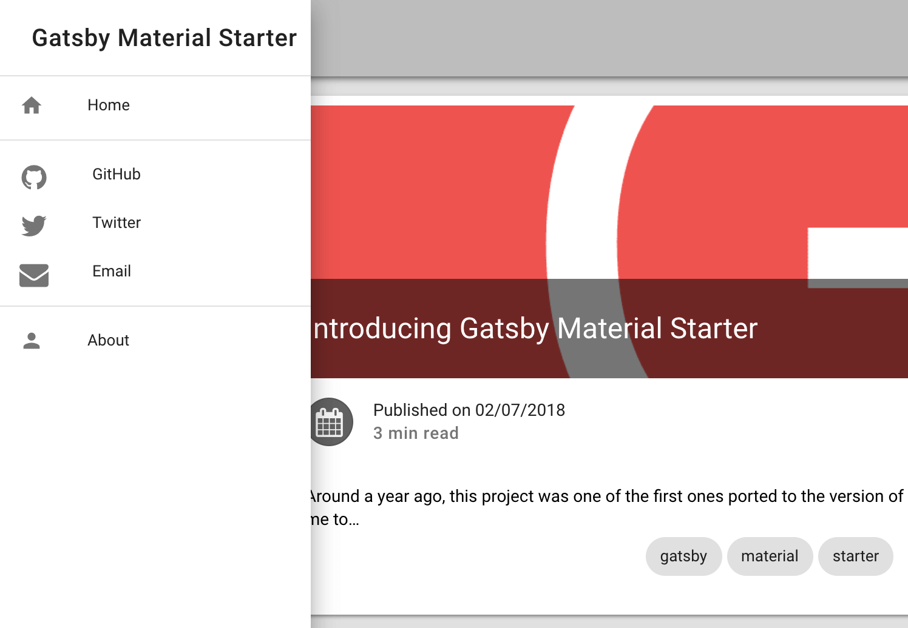

Gatsbyのはじめ方に少し手間取ったのでメモ。

## 要件
- Node.js 11.0.0
- NPM 6.5.0
- Gatsby CLI 2.4.7

```console
$ node -v
v11.0.0

$ npm -v
6.5.0

$ gatsby -v
2.4.7
```

## Gatsby CLIのインストール
Node.js, NPMさえ入っていれば、これは手こずりません。[Gatsbyクイックスタート](https://www.gatsbyjs.org/docs/quick-start)のとおりにNPM経由でインストールします。

```bash
npm install --global gatsby-cli
```

## Gatsbyサイトの作成
Gatsbyサイトを作成するには、Gatsby CLIの`new`コマンドを使用します。しかし、ゼロからサイトを作成するのは大変なので、今回はStarterと呼ばれるサイトテンプレートを使用します。このStarterは、Gatsby1とGatsby2の間で互換性の維持されているものが(試した範囲では)見つからなかったので、ここで適切なものを選ばないと、けっこうハマります。

Starterは、Gatsbyの公式サイトにまとめられており、以下のページで探すことができます。<br>
https://www.gatsbyjs.org/starters/?v=2

Starterは、Gatsby CLIの`new`コマンドのオプションに、GitHubリポジトリーを指定することで適用します。今回はこのブログのベースにもなっている[Gatsby Material Starter](https://github.com/Vagr9K/gatsby-material-starter)を使用してみます。

```bash
SITE_NAME="demo-site"
gatsby new ${SITE_NAME} https://github.com/Vagr9K/gatsby-material-starter
```

## Gatsbyサイトの起動
ここまで済めば、あとは起動するだけです。開発モードで起動すると`localhost:8000`でサイトが起動します。

```bash
cd demo-site/
gatsby develop
```

ブラウザでアクセスすると、以下のようなページが表示されます。かんたんでしたね。


