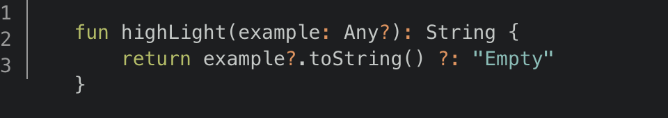
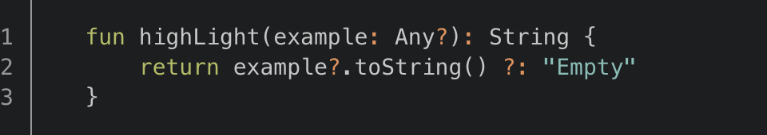

ブログをGatsby移行するにあたって、すこし面倒だったシンタックスハイライトの行番号表示をまとめます。

## 要件
- Node.js 11.0.0
- NPM 6.5.0
- Gatsby CLI 2.4.7
- Gatsby 2.0.40
- Vagr9K/gatsby-material-starter 2019.01.04現在
- gatsby-remark-prismjs 3.0.3

```console
$ node -v
v11.0.0

$ npm -v
6.5.0

$ gatsby -v
2.4.7
```

`Vagr9K/gatsby-material-starter`をGatsbyテンプレートとして使用しますが、基本的にはどのStarterで始めても同じような対応で問題ないはずです。(スタイルは多少調整が必要になります。)

## シンタックスハイライト設定
`Vagr9K/gatsby-material-starter`には、シンタックスハイライトするためのプラグイン`gatsby-remark-prismjs`が既に適用されているので、行番号を表示するためにはまず、`gatsby-config.js`を編集して、この設定を変更します。

```javascript{17-26}
{
  resolve: "gatsby-transformer-remark",
  options: {
    plugins: [
      {
        resolve: "gatsby-remark-relative-images"
      },
      {
        resolve: "gatsby-remark-images",
        options: {
            maxWidth: 672
        }
      },
      {
        resolve: "gatsby-remark-responsive-iframe"
      },
      {
        resolve: "gatsby-remark-prismjs",
        options: {
          classPrefix: "language-",
          inlineCodeMarker: null,
          aliases: {},
          showLineNumbers: true,
          noInlineHighlight: false,
        },
      },
      "gatsby-remark-copy-linked-files",
      "gatsby-remark-autolink-headers"
    ]
  }
},
```

## 行数表示用CSSのインポート
`gatsby-remark-prismjs`は、プラグインを適用しただけでは行番号が表示されません。`prismjs`に同梱、配布されている行番号表示用のCSSをインポートする必要があります。プロジェクトルートディレクトリの`gatsby-browser.js`に、以下を追記します。(ファイルがなければ作成します。)

```javascript
import 'prismjs/plugins/line-numbers/prism-line-numbers.css';
```

## マークダウンで行番号表示を有効化
ここまで設定したら行番号表示を有効化できます。行番号表示を有効にするには、マークダウン上のコードブロック記法に`{numberLines:true}`を追加します。

<div class="gatsby-highlight" data-language="text">
<pre class="language-text"><code class="language-text">```kotlin{numberLines:true}
fun highLight(example: Any?): String {
    return example?.toString() ?: "Empty"
}
```</code></pre>
</div>

ここまでの設定に問題がなければ、以下のように表示されるはずです。行番号、ズレています。



## スタイルの微調整
最後にスタイルを調整して、行番号の縦位置を整えます。`Vagr9K/gatsby-material-starter`をサイトテンプレートに使用している場合は、`src/layout/theme.scss`に以下を追記します。

```css
.line-numbers .line-numbers-rows {
   padding: 1rem 0;
}
```

行番号の縦位置が整いました。より細やかな表示の調整が必要な場合は、さらに`src/layout/theme.scss`を編集したり、シンタックスハイライトのテーマファイルを差し替えたりすることができますが、ここでは割愛します。


