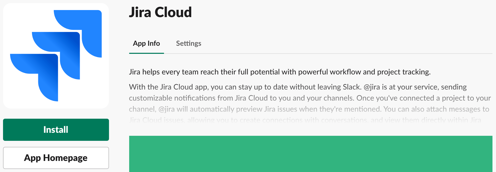
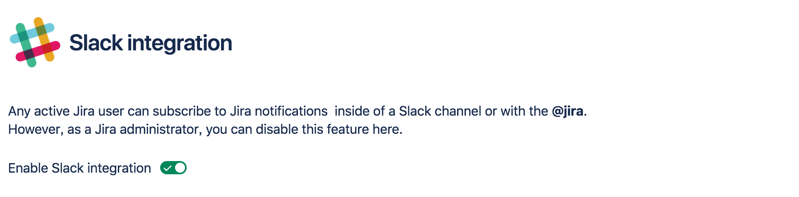
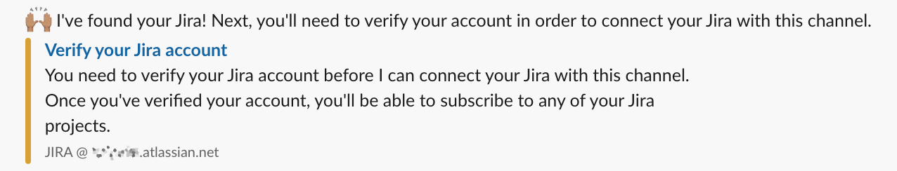
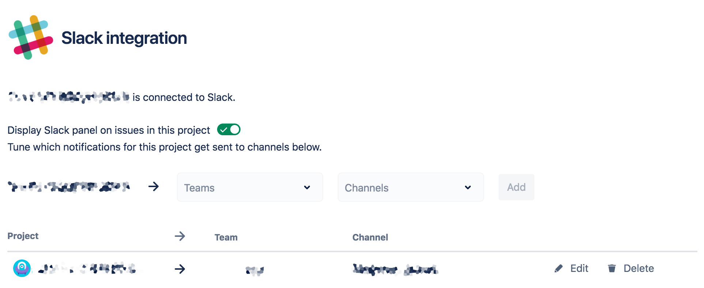
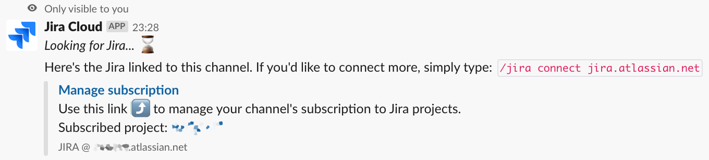

SlackとJIRAを連携するには、Jira Cloudを使うか、Jira Server Alertsを使うことになります。どちらでも連携自体は可能ですが、通知内容はJira Cloudのほうがよりリッチで、Slackを離れることなくIssueを把握しやすいです。

ところが、Jira Cloudは、セットアップ方法の説明がSlack側のドキュメントだけで完結しておらず、少々分かりづらくなっています。ドキュメントの在り処さえわかってしまえば難しい話ではないのですが、エラーメッセージをもとに検索しなければならず、少々の不便を感じます。ドキュメントはそれぞれ以下にあります。

- [Jira と Slack を連携させる - Jira Cloud](https://get.slack.help/hc/ja/articles/218475657-Jira-%E3%81%A8-Slack-%E3%82%92%E9%80%A3%E6%90%BA%E3%81%95%E3%81%9B%E3%82%8B#jira-cloud-1)
- ["Connecting with this Jira Cloud instance was disabled by administrator" というメッセージが表示されます。なぜでしょうか。](https://ja.confluence.atlassian.com/jirasoftwarecloud/jira-cloud-for-slack-950819054.html#JiraCloudforSlack-WhyamIseeingthemessage%22ConnectingwiththisJiraCloudinstancewasdisabledbyadministrator%22?)

ドキュメントの要約になりますが、手順をまとめると以下のようになります。

## 環境要件
- Slack 2019-02-16現在
- Atlassian JIRA 2019-02-16現在
- 連携するJIRAのサイト管理者権限を持っていること

## Slack Jira Cloudアプリのインストール
1. SlackのAppディレクトリでJira Cloudページにアクセスします
2. アプリケーションロゴ下部の[`Install`ボタン](https://atlassian-slack-integration.services.atlassian.com/api/slack/login)をクリックします
3. Jira Cloudで許可したいSlackワークスペースを選択します
4. `Authorize`ボタンをクリックします

インストールが成功すると、JIRAのボットユーザーからダイレクトメッセージが届きます。

## JIRA Slack integrationの設定
`https://<instancename>.atlassian.net/plugins/servlet/ac/jira-slack-integration/addon-config-page`にアクセスして、`Enable Slack integration`を有効にします。`<instancename>`は使用しているJIRAのURLを確認し、これに読み替えてください。

## SlackでJIRAに接続
Slack上の連携したいチャネル上で、`/jira connect <instancename>.atlassian.net`コマンドを送信します。
接続が成功するとJIRAのボットユーザーから、以下のようなメッセージが届くので、`Verify your Jira account`のリンクを踏んで、連携内容を設定します。

連携の設定は、連携するプロジェクトとチャネルの設定が主で、これだけでJIRAの更新通知がSlackに流れ込んでくるようになります。

なお、JIRAでSlack連携の設定画面を再び表示するには、JIRAと連携済みのSlackチャネル上で、`/jira`コマンドを実行します。コマンドを実行すると、`Manage subscription`リンクが表示され、これをクリックすると設定画面へ移動できます。

## 参考
- [Jira と Slack を連携させる - Jira Cloud](https://get.slack.help/hc/ja/articles/218475657-Jira-%E3%81%A8-Slack-%E3%82%92%E9%80%A3%E6%90%BA%E3%81%95%E3%81%9B%E3%82%8B#jira-cloud-1)
- ["Connecting with this Jira Cloud instance was disabled by administrator" というメッセージが表示されます。なぜでしょうか。](https://ja.confluence.atlassian.com/jirasoftwarecloud/jira-cloud-for-slack-950819054.html#JiraCloudforSlack-WhyamIseeingthemessage%22ConnectingwiththisJiraCloudinstancewasdisabledbyadministrator%22?)
