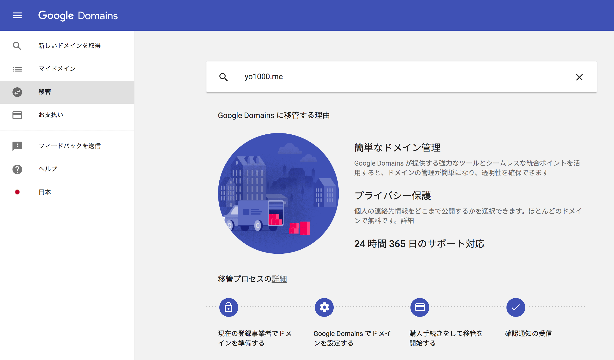

Google Domainsで、トップレベルドメイン`dev`の提供が開始されたのを機に、保有ドメインを移管してみました。

ドメイン登録事業者は数多くありますが、それらの中でもお名前ドットコムを使っていた理由のひとつが、ドメイン名の取扱いだけではなく、同サービス上でDNSを無償提供しているという点にありました。ところがGoogle DomainsでもDNSは無償提供されているんですね。となるとGoogle Domainsに移管してしまえば、わざわざお名前ドットコムで、使いづらいコントロールパネルを使い続けなくてもいいわけです。

そこで移管を考えるにあたり、それぞれ気になる部分の特徴を比較してみます。

|                  | お名前ドットコム | Google Domains |
|:-----------------|:--------------|:---------------|
| DNS提供          | 👍無償         | 👍無償         |
| Whois代行        | 👍できる       | 👍できる        |
| コントロールパネル | ❌わかりづらい   | 👍わかりやすい  |
| メアド作成        | ❌できない      | 👍Gmailのエイリアスにできる |
| ドメインの種類     | 👍多い         | 👍多い        |
| ドメインの価格     | 👍安い         | 😌ふつう      |
| 格安ドメイン取扱い  | 👍ある         | ❌ない       |

Google Domainsは、UIがわかりやすいだけでなく、取得したドメインで自由なユーザー部を持ったメールアドレスの作成もできます。作成したメールアドレスに専用の受信ボックスが用意されるわけではありませんが、すでにお使いのGmailへのエイリアスとして設定できるため、とても使い勝手は良いです。

というわけで移管していきます。

## 環境要件
- お名前ドットコム 2019-03-09現在
- Google Domains 2019-03-09現在

## 諸注意
移管前にいくつかの諸注意があるので確認してください。

### 移管要件
移管を始める前に、手持ちのドメインがGoogle Domainsでも管理可能なドメインかどうか、**必ず確認するようにしてください。**Google Domainsと、お名前ドットコムでは、トップレベルドメインの取扱いに微妙に差があり、お名前ドットコムで取扱いがあっても、Google Domainsでは取扱われていない(つまり管理できない)トップレベルドメインもいくつか存在します。(Google Domainsで取扱われていて、お名前ドットコムで取扱いがないものもあります。)

とくに、お名前ドットコムで提供されている格安ドメイン(`xyz`や`work`など)は、Google Domainsで取扱いがなく、管理できないので注意が必要です。

Google Domainsで管理可能なトップレベルドメインは、以下で確認できます。
https://support.google.com/domains/answer/6010092?hl=ja

### 移管費用
移管自体にかかる費用はありませんが、移管のためにドメインの有効期限を1年分購入する必要があります。各トップレベルドメインごとの料金は、以下で確認できます。
https://support.google.com/domains/answer/6010092?hl=ja

### ドメインの有効期限
すでに購入済みのドメイン有効期限は持ち越されます。お名前ドットコムの方が安いドメインもあるため、長く使用することを想定している場合は、事前に有効期限を延長購入してから移行すると、すこしだけお得です。

## 移管手順
移管手順は以下のようになります。

1. お名前ドットコムで移管準備
    - 認証コード(AuthCode)の確認
    - [ドメイン移管ロック]の解除
    - [Whois情報公開代行設定]の解除
2. Google Domainsで移管手続き
    1. 移管ドメインの検索
    2. 認証コード(AuthCode)の入力
    3. DNS設定の移行確認
    4. Whois代行、自動更新の設定
3. ドメイン移管を承認

## お名前ドットコムで移管準備
ドメイン移管には、移管元が発行する認証コードが必要になるため、これを取得します。また手持ちのドメインを移管可能な状態にするため、各種設定の確認もしていきます。

### 認証コード(AuthCode)の確認
[お名前.com Navi](https://www.onamae.com/navi/login/)にログインし、ページ上部のメニューから、[ドメイン一覧] > (移管するドメイン名のリンク)とページ移動します。

[ドメイン詳細]ページに移動するので、ページ内の[AuthCode]の箇所で、[表示させる]ボタンをクリックして、認証コードを控えます。

### [ドメイン移管ロック]の解除
ページ上部のメニューから、[ドメイン設定] > [ドメイン移管ロック]とページ移動します。状態を確認し、ロックされていればこれを解除します。(わたしの場合は未設定だったため、設定変更はとくに必要ありませんでした。)

### [Whois情報公開代行設定]の解除
ページ上部のメニューから、[ドメイン設定] > [Whois情報公開代行設定]とページ移動します。設定を解除するドメイン名にチェックを入れ、[設定変更内容]で[WHOIS情報公開代行を解除]を選択して、[次へ]ボタンをクリックします。確認ダイアログが表示されるので、[解除する]をクリックして解除を完了します。

## Google Domainsで移管手続き
お名前ドットコムで移管の準備が整ったら、続いてはGoogle Domainsで移管手続きをします。

### 移管ドメインの検索
[Google Domains 移管](https://domains.google.com/m/registrar/transfer)ページで、移管するドメイン名を入力、検索します。

### 認証コード(AuthCode)の入力
移管可能なドメインが見つかると、移管手続きページに移動します。先の手順で控えた[認証コード]を入力し、[続行]ボタンをクリックします。

### DNS設定の移行確認
DNSレコードが見つかると、移行確認を求められるので、移行すべきレコードがある場合は内容を確認し、不要なレコードがある場合はこれを削除して、[続行]ボタンをクリックします。

### Whois代行、自動更新の設定
Whoisの情報公開を代行させたい場合は、[プライバシー保護を有効にする]をオンにします。ドメインの有効期限が迫ったときに、自動的に有効期限の延長を購入したい場合は[自動更新オン]をオンにします。それぞれの設定確認が済んだら、[ご購入手続きに進む]ボタンをクリックします。

ここまでの手続きが完了すると、[マイドメイン](https://domains.google.com/m/registrar/)ページで、[保留中のドメイン]として、移管中のドメインを確認できるようになります。

## ドメイン移管を承認
ここまでの手続きを完了して、しばらく(わたしの場合は1時間前後でした)待っていると、お名前ドットコムから、[【重要】トランスファー申請に関する確認のご連絡]というメールが届きます。

内容を確認し、これに従い、案内されたURLヘアクセスします。

[他社へのドメイン移管　承認フォーム - 承認]ページが開くので、内容を確認し、[承認する]ボタンをクリックします。

[他社へのドメイン移管　承認フォーム - 確認]ページへ移動し、再度確認を求められるので、間違いなければ、[決定]ボタンをクリックします。

以上で、移管手続きは完了です。この時点から数時間後(わたしの場合は6時間はかからない程度でしたが、1時間以上はかかりました)に、ドメインの移管がすべて完了し、[マイドメイン](https://domains.google.com/m/registrar/)ページから、移管したドメインのすべての機能を利用できるようになります。

なお、移管手続きに失敗した場合は、Googleから追加購入した1年分のドメイン有効期限の払い戻しメールが届きます。

## 参考
- https://help.onamae.com/app/answers/detail/a_id/8593
