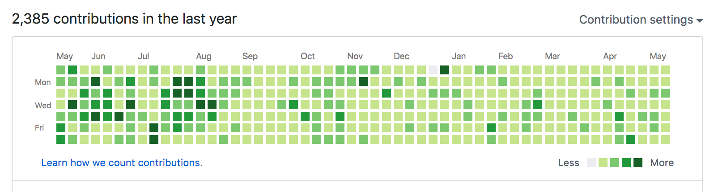

すこし前の話になりますが、GitHubで草を育てる活動をはじめて、1年が経ちました。忘れないように活動中に感じていたことなど残しておこうと思います。一年で生えた草は以下のようになりました。

1日だけ草の生えていない日は、第二子が生まれて数日後の日曜日で、いろいろと忙しくてどうしても何も手につかなかった日です。

## 良かったこと
- 日常的に、なにかコントリビュートできないかと思いを巡らせるようになった。(半ば強制的に。)
- タスクごとにコマメにIssueやPR作成するようになり、課題やPRの粒度感がちょうどよくなった。
- いろいろなものをGitHubで管理するようになった。(このブログも。)

## あまり良くなかったこと
- コントリビュートに寄与しない活動の優先度が下がる。
  - 検証作業とか。
  - まとまった規模の変更とか。(避けたくても発生するときはするので。)
- コントリビュートの発生していない日は、頭の何処かでずっとそれを考えてしまう。
  - 家族と過ごしていても考えてしまう。
- 自由な時間が抑圧されがちになる。
  - 心身が休まらない。

## 総評
一人である程度の自由が利く環境に身を置いているならば、一度経験してみる分には良いです。まだまだ技術的に自信の持てるものがなかったり、経験が浅かったりして、自身の成長のために、なにか目標を立てたい、集中したい、自身を律したいというような場合には、一つの指標としてわかりやすいので、わりと有効かもしれません。

一方、何かしら環境制約がある場合、とくに無理してやる必要はないです。とくに小さな子どもがいる家庭では、全くおすすめしません。子どもの成長はOSSや技術の移ろいなんかよりももっと早く、二度として同じ経験はできません。子どもが休日に一人で(または友達と)遊びたいと主張してくるまでは、子どもと過ごす時間を大事にしてください。草を育てる前に、あなたの子どもを育てましょう。
