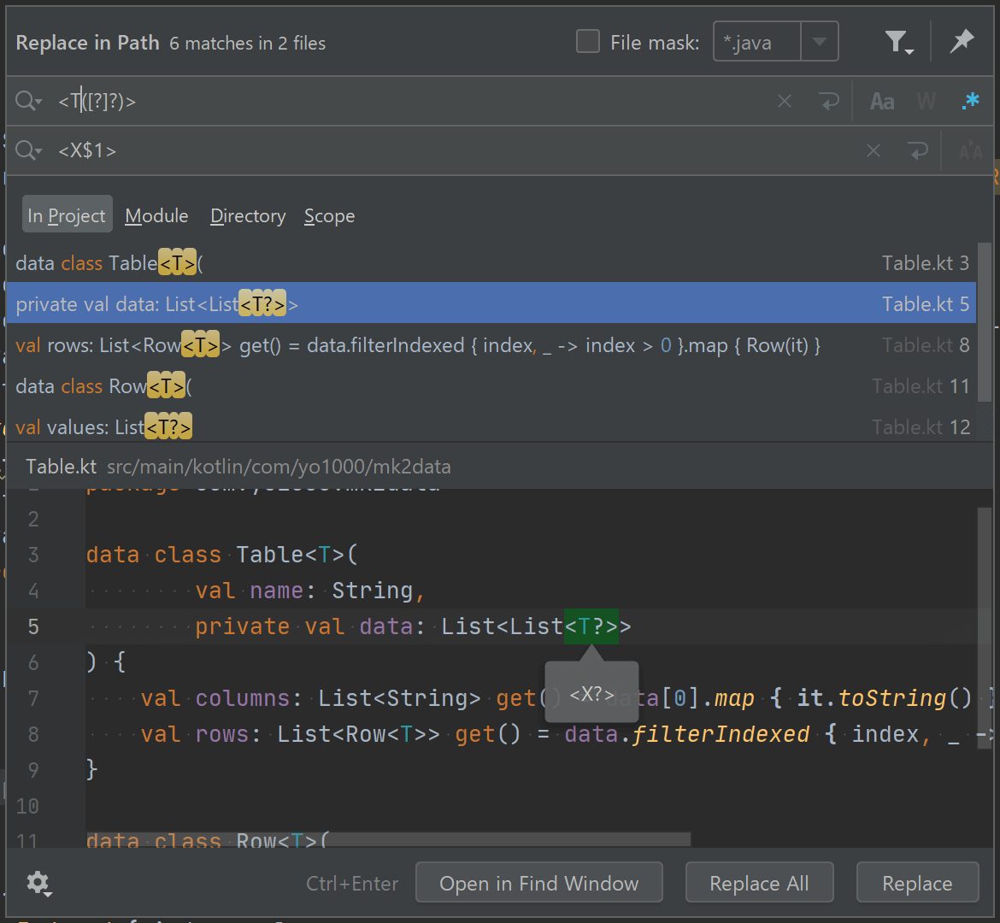
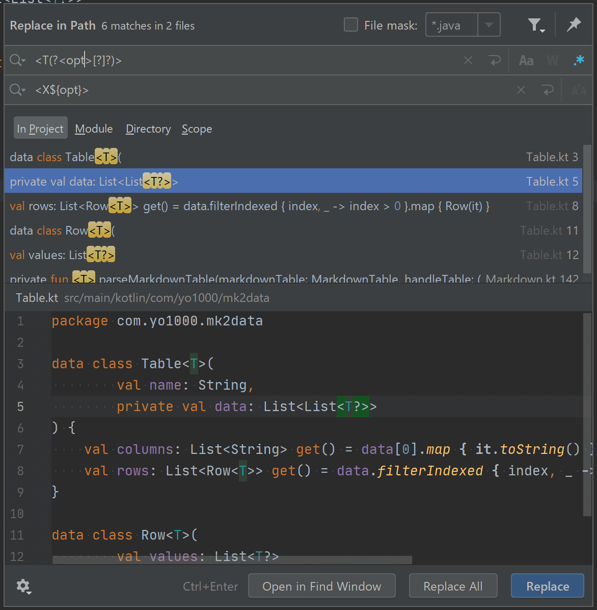

IntelliJ IDEA を使った置換で正規表現検索が使えるのは、利用者であれば誰でも知るところですが、実はこの正規表現検索、グループのキャプチャができる。これがもう非常に便利なので、その方法を書き残しておく。

## 環境要件
* IntelliJ IDEA ULTIMATE 2020.1

ただし、このバージョンはあくまで執筆確認時のものというだけで、
ULTIMATE である必要もなければ、2020.1 ほど新しいバージョンでなく
以前のバージョンでも問題ありません。

## グループのキャプチャ
### 通常のキャプチャ
書式としては `(PATTERN)` でグループを定義する、というのは標準的な正規表現の使い方と変わりません。
キャプチャした変数をどのように参照するのか、というのが実装によりけりで、
IntelliJ ではどうするのか、というのが本題です。

IntelliJ では `$1`, `$2`, .. という書き方で、
マッチしたグループの順にインデックス番号を使って変数を参照できます。

### 名前付きキャプチャ
また、名前付きキャプチャも可能で、名前付きキャプチャの場合は、
書式は通常の正規表現同様 `(?<name>PATTERN)` でグループの定義、
参照は `${name}` という書き方になります。

ただし、名前付きキャプチャの場合、インデックスによる参照とは異なり、
置換後のプレビューができなくなるので少々不便だったりします。
せっかく名前付きキャプチャで便利になったように見えて逆に不便という。

## 参考
- https://stackoverflow.com/a/43430163
