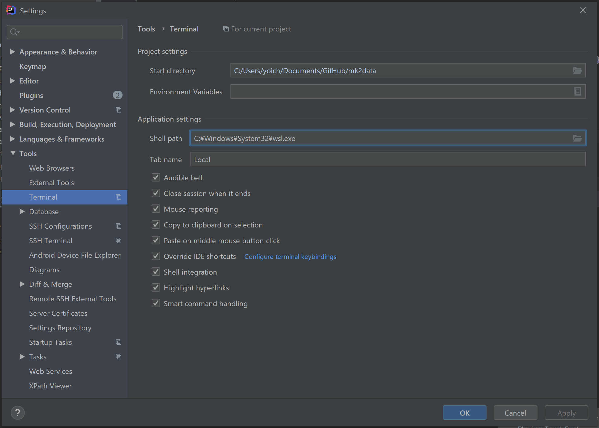

WSL 2 もリリースされたことで、Windows での開発がだいぶ macOS に近づいてきました。それでも Windows のデフォルトシェル環境は相変わらず cmd.exe なので、IntelliJ のターミナルシェルも相変わらず cmd.exe です。

さすがにそのままだと使いづらいので、これを WSL に変更します。


## 環境要件
* IntelliJ IDEA ULTIMATE 2020.1

ただし、このバージョンはあくまで執筆確認時のものというだけで、
ULTIMATE である必要もなければ、2020.1 ほど新しいバージョンでなく以前のバージョンでも問題ありません。


## シェルの変更
GUI でぽちぽち設定していきます。以下のように設定を開いていきます。

[File] > [Settings...] > [Tools] > [Terminal]

[Application settings] の [Shell path] を `C:\Windows\System32\wsl.exe` に変更します。`wsl.exe` のパスが異なる場合は、それに応じたものを設定します。



これで IntelliJ のターミナルが WSL になり、インストールした OS のターミナルセッションが開くようになります。ぱっと見、macOS で IntelliJ を使っているのと遜色ないように見えます。(見えるだけで、まだけっこう違う部分も多いので注意。)


## ホームディレクトリの変更
前述の通り、これだけだと一見良さそうに見えて、まだ何も良くありません。

何が良くないかというと、ホームディレクトリが2つある状態になっています。
Windows のユーザーホームと、WSL でインストールした Linux ディストリのユーザーホームがそれぞれ存在している状態です。
このままだと、あらゆる dotfile が別々に二重管理されてしまいます。

ターミナルで加えた変更は IntelliJ から見えず (IntelliJ の GUI は Windows ユーザーのホームディレクトリを見る)、IntelliJ の GUI 経由で加えた変更はターミナルから見えない状態となり (IntelliJ のターミナルは Linux ユーザーのホームディレクトリを見る)、様々な作業に混乱をきたします。

そこでこの不一致を解消するため、WSL 側のホームディレクトリを変更します。

まずは WSL から Windows のホームディレクトリがどう見えているかを確認します。通常は以下のパスでマウントされているはずです。

`/mnt/{ドライブレター}/Users/{Windows ユーザー名}`

念のため、実在しているかどうか確認しておきます。

```
ls /mnt/{ドライブレター}/Users/{Windows ユーザー名}
'3D Objects'             NTUSER.DAT{53b39e88-18c4-11ea-a811-000d3aa4692b}.TM.blf
 AppData                 NTUSER.DAT{53b39e88-18c4-11ea-a811-000d3aa4692b}.TMContainer00000000000000000001.regtrans-ms
'Application Data'       NTUSER.DAT{53b39e88-18c4-11ea-a811-000d3aa4692b}.TMContainer00000000000000000002.regtrans-ms
 Contacts                NetHood
 Cookies                 OneDrive
'Creative Cloud Files'   Pictures
 Desktop                 PrintHood
...
```

Windows のホームディレクトリっぽいファイル群が返ってくるのを確認したら、続いて `sudo vi /etc/passwd` で、WSL で使用しているユーザーのホームディレクトリを変更します。

変更前は以下のようになっているはずなので、

```
{ユーザー名}:x:1000:1000:,,,:/home/{ユーザー名}:/bin/bash
```

以下のように変更します。

```
{ユーザー名}:x:1000:1000:,,,:/mnt/{ドライブレター}/Users/{Windows ユーザー名}:/bin/bash
```

変更を保存したら、一度ターミナルセッションから抜けて、改めてターミナルを開きます。`pwd` コマンドでホームディレクトリの変更を確認したら、これで設定は完了です。

```
pwd
/mnt/{ドライブレター}/Users/{Windows ユーザー名}
```

以降は設定の二重管理のようなことが起こらず、macOS で IntelliJ を使っているのにかなり近い状態となります。べんり。


## 参考
- https://stackoverflow.com/a/51912773
